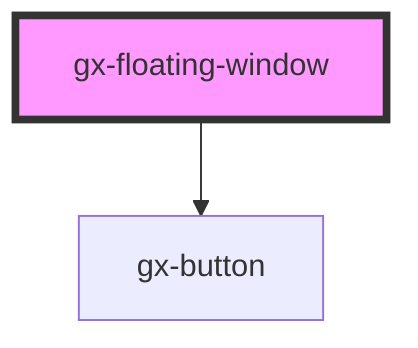

# gx-floating-window

<!-- Auto Generated Below -->

## Properties

| Property       | Attribute       | Description                                        | Type      | Default     |
| -------------- | --------------- | -------------------------------------------------- | --------- | ----------- |
| `expandedSize` | `expanded-size` | Width of expanded window. Default 300px            | `"300px"` | `"300px"`   |
| `isMinimized`  | `is-minimized`  | Determines if the menu is minimized                | `boolean` | `false`     |
| `isUnlocked`   | `is-unlocked`   | Determines if the menu is unlocked                 | `boolean` | `false`     |
| `mainTitle`    | `main-title`    | This property specifies the items of the chat.     | `string`  | `undefined` |
| `resizeWindow` | `resize-window` | Determines if the menu can be unlocked or minimize | `boolean` | `true`      |

## Shadow Parts

| Part          | Description |
| ------------- | ----------- |
| `"container"` |             |
| `"controls"`  |             |
| `"header"`    |             |
| `"title"`     |             |

## Dependencies

### Depends on

- gx-button

### Graph

----------------------------------------------

*Built with [StencilJS](https://stenciljs.com/)*
