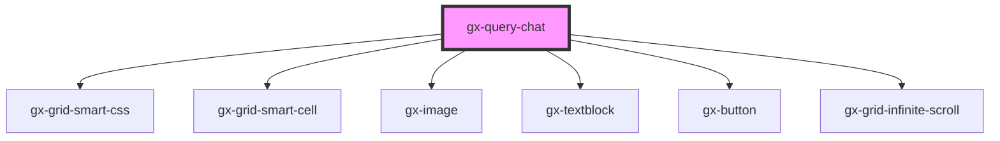

# gx-query-chat

<!-- Auto Generated Below -->

## Properties

| Property | Attribute | Description                                    | Type              | Default     |
| -------- | --------- | ---------------------------------------------- | ----------------- | ----------- |
| `items`  | --        | This property specifies the items of the chat. | `QueryChatItem[]` | `undefined` |

## Dependencies

### Depends on

- gx-grid-smart-css
- gx-grid-smart-cell
- gx-image
- gx-textblock
- gx-button
- gx-grid-infinite-scroll

### Graph

----------------------------------------------

*Built with [StencilJS](https://stenciljs.com/)*
