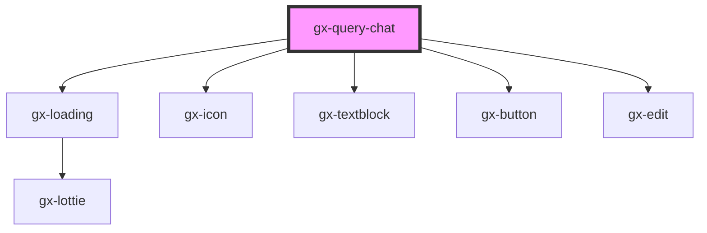

# gx-query-chat

<!-- Auto Generated Below -->

## Properties

| Property          | Attribute           | Description                                                                                                                                                                                                                                                                                          | Type     | Default             |
| ----------------- | ------------------- | ---------------------------------------------------------------------------------------------------------------------------------------------------------------------------------------------------------------------------------------------------------------------------------------------------- | -------- | ------------------- |
| `apiKey`          | `api-key`           | This is GxQuery authentication key. It will required when property useGxQuery = true                                                                                                                                                                                                                 | `string` | `""`                |
| `baseUrl`         | `base-url`          | This is the GxQuery base URL. It will required when property useGxQuery = true                                                                                                                                                                                                                       | `string` | `""`                |
| `messageIconSize` | `message-icon-size` | Specify the size of the icon messages. ex 50px                                                                                                                                                                                                                                                       | `string` | `"40px"`            |
| `metadataName`    | `metadata-name`     | This is the name of the metadata (all the queries belong to a certain metadata) the connector will use when useGxquery = true. In this case the connector must be told the query to execute, either by name (via the objectName property) or giving a full serialized query (via the query property) | `""`     | `""`                |
| `placeholder`     | `placeholder`       | Text that appears in the input control when it has no value set                                                                                                                                                                                                                                      | `string` | `"Ask me question"` |
| `saiaToken`       | `saia-token`        | This is GxQuery Saia Token. It will required when property useGxQuery = true                                                                                                                                                                                                                         | `string` | `""`                |
| `saiaUserId`      | `saia-user-id`      | This is GxQuery Saia User ID (optional). It will use when property useGxQuery = true                                                                                                                                                                                                                 | `string` | `""`                |

## Events

| Event                 | Description                              | Type                                |
| --------------------- | ---------------------------------------- | ----------------------------------- |
| `gxAssistantResponse` | Fired when receive a question answer     | `CustomEvent<QueryViewerBase>`      |
| `gxUserRequest`       | Fired each time the user make a question | `CustomEvent<{ message: string; }>` |

## Methods

### `gxCleanChat() => Promise<void>`

Clean chat

#### Returns

Type: `Promise<void>`

## Shadow Parts

| Part             | Description |
| ---------------- | ----------- |
| `"chat-history"` |             |

## Dependencies

### Depends on

- gx-loading
- gx-icon
- gx-textblock
- gx-button
- gx-edit

### Graph

----------------------------------------------

*Built with [StencilJS](https://stenciljs.com/)*
