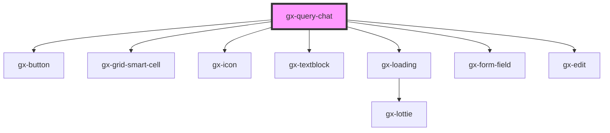

# gx-query-chat

<!-- Auto Generated Below -->

## Properties

| Property          | Attribute           | Description                                                                                                                                                                                                                                                                                          | Type                  | Default               |
| ----------------- | ------------------- | ---------------------------------------------------------------------------------------------------------------------------------------------------------------------------------------------------------------------------------------------------------------------------------------------------- | --------------------- | --------------------- |
| `isMinimized`     | `is-minimized`      | Determines if the menu is minimized                                                                                                                                                                                                                                                                  | `boolean`             | `false`               |
| `isUnlocked`      | `is-unlocked`       | Determines if the menu is unlocked                                                                                                                                                                                                                                                                   | `boolean`             | `false`               |
| `mainTitle`       | `main-title`        | This property specifies the items of the chat.                                                                                                                                                                                                                                                       | `string`              | `undefined`           |
| `messageIconSize` | `message-icon-size` | Specify the size of the icon messages. ex 50px                                                                                                                                                                                                                                                       | `string`              | `"50px"`              |
| `metadataName`    | `metadata-name`     | This is the name of the metadata (all the queries belong to a certain metadata) the connector will use when useGxquery = true. In this case the connector must be told the query to execute, either by name (via the objectName property) or giving a full serialized query (via the query property) | `"ReportingShowcase"` | `"ReportingShowcase"` |
| `placeholder`     | `placeholder`       | Text that appears in the input control when it has no value set                                                                                                                                                                                                                                      | `string`              | `"Ask me question"`   |
| `resizewindow`    | `resizewindow`      | Determines if the menu can be unlocked or minimize                                                                                                                                                                                                                                                   | `boolean`             | `true`                |

## Events

| Event              | Description                              | Type                                                                                                                                                                |
| ------------------ | ---------------------------------------- | ------------------------------------------------------------------------------------------------------------------------------------------------------------------- |
| `gxQuerySelect`    | Fired when receive a question answer     | `CustomEvent<Omit<QueryViewerBase, "Modified"> & { Id: string; Name: string; Description: string; Expression: string; Modified: Date; differenceInDays: number; }>` |
| `queryChatRequest` | Fired each time the user make a question | `CustomEvent<{ message: string; }>`                                                                                                                                 |

## Dependencies

### Depends on

- gx-button
- gx-grid-smart-cell
- gx-icon
- gx-textblock
- gx-loading
- gx-form-field
- gx-edit

### Graph

----------------------------------------------

*Built with [StencilJS](https://stenciljs.com/)*
