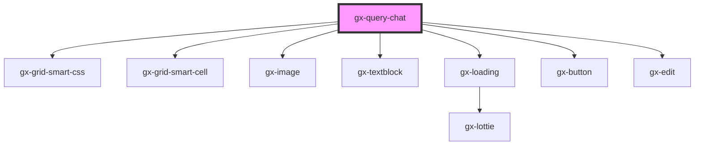

# gx-query-chat

<!-- Auto Generated Below -->

## Properties

| Property      | Attribute      | Description                                                     | Type      | Default             |
| ------------- | -------------- | --------------------------------------------------------------- | --------- | ------------------- |
| `isMinimized` | `is-minimized` | Determines if the menu is minimized                             | `boolean` | `false`             |
| `isUnlocked`  | `is-unlocked`  | Determines if the menu is unlocked                              | `boolean` | `false`             |
| `mainTitle`   | `main-title`   | This property specifies the items of the chat.                  | `string`  | `undefined`         |
| `minimizable` | `minimizable`  | Determines if the menu can be minimized                         | `boolean` | `true`              |
| `placeholder` | `placeholder`  | Text that appears in the input control when it has no value set | `string`  | `"Ask me question"` |
| `unlockable`  | `unlockable`   | Determines if the menu can be unlocked                          | `boolean` | `true`              |

## Events

| Event              | Description                              | Type                                |
| ------------------ | ---------------------------------------- | ----------------------------------- |
| `queryChatRequest` | Fired each time the user make a question | `CustomEvent<{ message: string; }>` |

## Methods

### `gxQueryAddResponse(item: GxChatItem) => Promise<void>`

#### Returns

Type: `Promise<void>`

## Dependencies

### Depends on

- gx-grid-smart-css
- gx-grid-smart-cell
- gx-image
- gx-textblock
- gx-loading
- gx-button
- gx-edit

### Graph

----------------------------------------------

*Built with [StencilJS](https://stenciljs.com/)*
