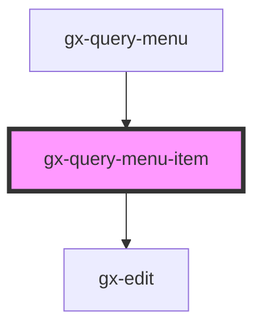

# gx-query-menu-item

<!-- Auto Generated Below -->

## Properties

| Property   | Attribute   | Description                                  | Type                                                                                                                                                   | Default     |
| ---------- | ----------- | -------------------------------------------- | ------------------------------------------------------------------------------------------------------------------------------------------------------ | ----------- |
| `editMode` | `edit-mode` | Toggle edit mode                             | `boolean`                                                                                                                                              | `false`     |
| `isActive` | `is-active` | Id of item active                            | `boolean`                                                                                                                                              | `false`     |
| `item`     | --          | This property specify the title of the item. | `Omit<QueryViewerBase, "Modified"> & { Id: string; Name: string; Description: string; Expression: string; Modified: Date; differenceInDays: number; }` | `undefined` |

## Events

| Event        | Description                           | Type                                                                                                                                                                |
| ------------ | ------------------------------------- | ------------------------------------------------------------------------------------------------------------------------------------------------------------------- |
| `deleteItem` | Trigger the action to delete the item | `CustomEvent<Omit<QueryViewerBase, "Modified"> & { Id: string; Name: string; Description: string; Expression: string; Modified: Date; differenceInDays: number; }>` |
| `renameItem` | Trigger the action to delete the item | `CustomEvent<Omit<QueryViewerBase, "Modified"> & { Id: string; Name: string; Description: string; Expression: string; Modified: Date; differenceInDays: number; }>` |
| `selectItem` | Trigger the action to select an item  | `CustomEvent<Omit<QueryViewerBase, "Modified"> & { Id: string; Name: string; Description: string; Expression: string; Modified: Date; differenceInDays: number; }>` |

## Methods

### `setFocus() => Promise<void>`

#### Returns

Type: `Promise<void>`

## Shadow Parts

| Part         | Description |
| ------------ | ----------- |
| `"controls"` |             |
| `"label"`    |             |

## Dependencies

### Used by

 - [gx-query-menu](../query-menu)

### Depends on

- gx-edit

### Graph

----------------------------------------------

*Built with [StencilJS](https://stenciljs.com/)*
