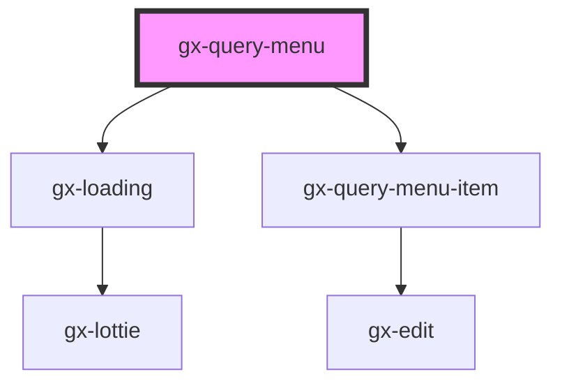

# gx-query-menu

<!-- Auto Generated Below -->

## Properties

| Property                | Attribute                 | Description                                                                                                                                                                                                                                                                                          | Type                                 | Default                                                                                                                                                                                                                                                    |
| ----------------------- | ------------------------- | ---------------------------------------------------------------------------------------------------------------------------------------------------------------------------------------------------------------------------------------------------------------------------------------------------- | ------------------------------------ | ---------------------------------------------------------------------------------------------------------------------------------------------------------------------------------------------------------------------------------------------------------- |
| `collapsedSidebarLabel` | `collapsed-sidebar-label` | Label to show in the collapsed button                                                                                                                                                                                                                                                                | `"collapse sidebar"`                 | `"collapse sidebar"`                                                                                                                                                                                                                                       |
| `collapsible`           | `collapsible`             | Determines if the menu can be collapsed                                                                                                                                                                                                                                                              | `boolean`                            | `true`                                                                                                                                                                                                                                                     |
| `expandSidebarLabel`    | `expand-sidebar-label`    | Label to show in the collapsed button                                                                                                                                                                                                                                                                | `"expand sidebar"`                   | `"expand sidebar"`                                                                                                                                                                                                                                         |
| `groupItemsByMonth`     | `group-items-by-month`    | Show queries items group by month                                                                                                                                                                                                                                                                    | `boolean`                            | `true`                                                                                                                                                                                                                                                     |
| `isCollapsed`           | `is-collapsed`            | Determines if the menu is collapsed                                                                                                                                                                                                                                                                  | `boolean`                            | `false`                                                                                                                                                                                                                                                    |
| `metadataName`          | `metadata-name`           | This is the name of the metadata (all the queries belong to a certain metadata) the connector will use when useGxquery = true. In this case the connector must be told the query to execute, either by name (via the objectName property) or giving a full serialized query (via the query property) | `string`                             | `process.env.METADATA_NAME`                                                                                                                                                                                                                                |
| `newChatCaption`        | `new-chat-caption`        | New Chat button caption                                                                                                                                                                                                                                                                              | `"New Chat"`                         | `"New Chat"`                                                                                                                                                                                                                                               |
| `rangeOfDays`           | --                        | Dates to group queries                                                                                                                                                                                                                                                                               | `{ days: number; label: string; }[]` | `[     { days: 0, label: "Today" },     { days: 1, label: "Yesterday" },     { days: 3, label: "Previous 3 days" },     { days: 5, label: "Previous 5 Days" },     { days: 7, label: "Previous 7 Days" },     { days: 10, label: "Previous 10 Days" }   ]` |
| `useGxquery`            | `use-gxquery`             | True to tell the controller to connect use GXquery as a queries repository                                                                                                                                                                                                                           | `boolean`                            | `undefined`                                                                                                                                                                                                                                                |

## Events

| Event           | Description    | Type                                                                                                                                                                |
| --------------- | -------------- | ------------------------------------------------------------------------------------------------------------------------------------------------------------------- |
| `gxQuerySelect` | Select a query | `CustomEvent<Omit<QueryViewerBase, "Modified"> & { Id: string; Name: string; Description: string; Expression: string; Modified: Date; differenceInDays: number; }>` |

## Shadow Parts

| Part           | Description |
| -------------- | ----------- |
| `"menu-list"`  |             |
| `"menu-title"` |             |
| `"sidebar"`    |             |

## Dependencies

### Depends on

- gx-loading
- [gx-query-menu-item](../query-menu-item)

### Graph

----------------------------------------------

*Built with [StencilJS](https://stenciljs.com/)*
