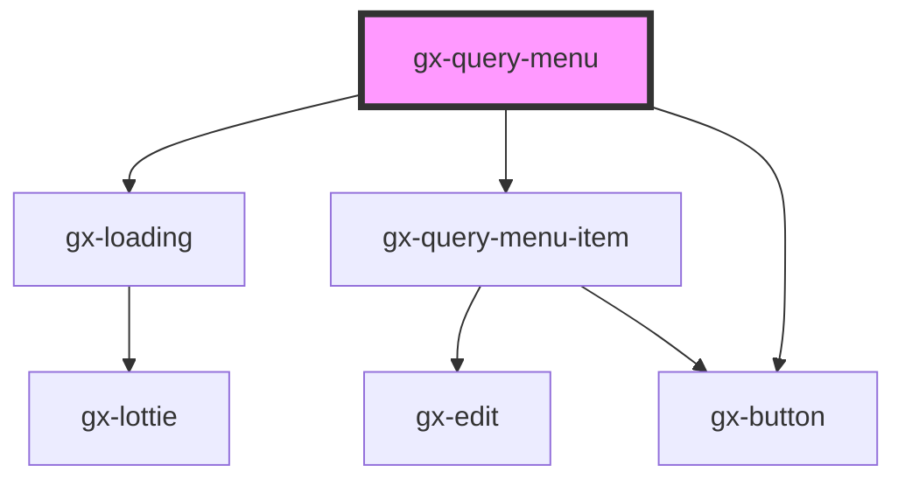

# gx-query-menu

<!-- Auto Generated Below -->

## Properties

| Property                | Attribute                 | Description                             | Type                                 | Default                                                                                                                                                                                                         |
| ----------------------- | ------------------------- | --------------------------------------- | ------------------------------------ | --------------------------------------------------------------------------------------------------------------------------------------------------------------------------------------------------------------- |
| `collapsedSidebarLabel` | `collapsed-sidebar-label` | Label to show in the collapsed button   | `"collapse sidebar"`                 | `"collapse sidebar"`                                                                                                                                                                                            |
| `collapsible`           | `collapsible`             | Determines if the menu can be collapsed | `boolean`                            | `true`                                                                                                                                                                                                          |
| `expandSidebarLabel`    | `expand-sidebar-label`    | Label to show in the collapsed button   | `"expand sidebar"`                   | `"expand sidebar"`                                                                                                                                                                                              |
| `groupItemsByMonth`     | `group-items-by-month`    | Show queries items group by month       | `boolean`                            | `true`                                                                                                                                                                                                          |
| `isCollapsed`           | `is-collapsed`            | Determines if the menu is collapsed     | `boolean`                            | `false`                                                                                                                                                                                                         |
| `newChatCaption`        | `new-chat-caption`        | New Chat button caption                 | `"New Chat"`                         | `"New Chat"`                                                                                                                                                                                                    |
| `rangeOfDays`           | --                        | Dates to group queries                  | `{ days: number; label: string; }[]` | `[     { days: 0, label: "Today" },     { days: 1, label: "Yesterday" },     { days: 5, label: "Previous 5 Days" },     { days: 7, label: "Previous 7 Days" },     { days: 10, label: "Previous 10 Days" }   ]` |

## Events

| Event                | Description | Type                                                                                                                             |
| -------------------- | ----------- | -------------------------------------------------------------------------------------------------------------------------------- |
| `gxQueryNewChat`     |             | `CustomEvent<void>`                                                                                                              |
| `gxQuerySelectQuery` |             | `CustomEvent<{ Id: string; Name: string; Description: string; Expression: string; Modified: Date; differenceInDays?: number; }>` |

## Dependencies

### Depends on

- gx-loading
- [gx-query-menu-item](../query-menu-item)
- gx-button

### Graph

----------------------------------------------

*Built with [StencilJS](https://stenciljs.com/)*
