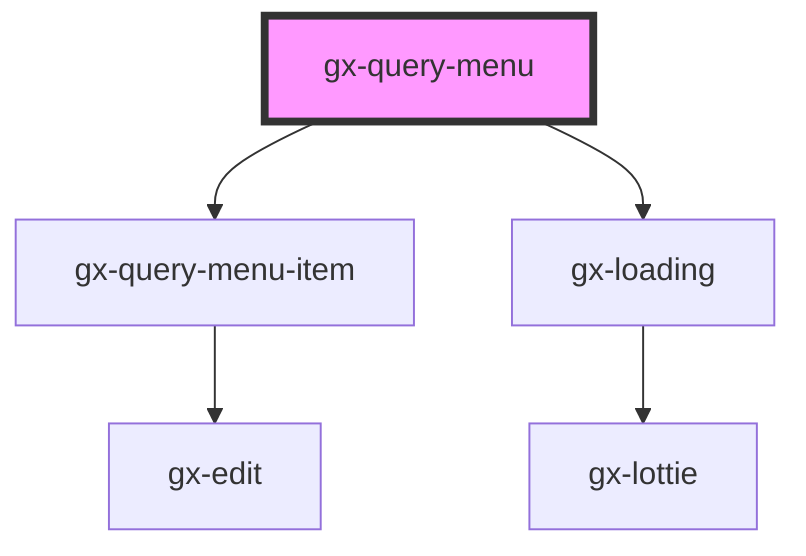

# gx-query-menu

<!-- Auto Generated Below -->

## Properties

| Property            | Attribute              | Description                                                                                                                                                                                                                                                                                          | Type                                 | Default                                                                                                                                                                                                                                                    |
| ------------------- | ---------------------- | ---------------------------------------------------------------------------------------------------------------------------------------------------------------------------------------------------------------------------------------------------------------------------------------------------- | ------------------------------------ | ---------------------------------------------------------------------------------------------------------------------------------------------------------------------------------------------------------------------------------------------------------- |
| `accessibleName`    | `accessible-name`      | Specifies a short string, typically 1 to 3 words, that authors associate with an element to provide users of assistive technologies with a label for the element.                                                                                                                                    | `"Query list"`                       | `"Query list"`                                                                                                                                                                                                                                             |
| `groupItemsByMonth` | `group-items-by-month` | Show queries items group by month                                                                                                                                                                                                                                                                    | `boolean`                            | `true`                                                                                                                                                                                                                                                     |
| `metadataName`      | `metadata-name`        | This is the name of the metadata (all the queries belong to a certain metadata) the connector will use when useGxquery = true. In this case the connector must be told the query to execute, either by name (via the objectName property) or giving a full serialized query (via the query property) | `string`                             | `process.env.METADATA_NAME`                                                                                                                                                                                                                                |
| `rangeOfDays`       | --                     | Dates to group queries                                                                                                                                                                                                                                                                               | `{ days: number; label: string; }[]` | `[     { days: 0, label: "Today" },     { days: 1, label: "Yesterday" },     { days: 3, label: "Previous 3 days" },     { days: 5, label: "Previous 5 Days" },     { days: 7, label: "Previous 7 Days" },     { days: 10, label: "Previous 10 Days" }   ]` |
| `serializedObject`  | `serialized-object`    | Use this property to pass a query obtained from GXquery. This disabled the call to GxQuery API:    Id: string;    Name: string;    Description: string;    Expression: string;    Modified: string;                                                                                                  | `string`                             | `undefined`                                                                                                                                                                                                                                                |
| `useGxquery`        | `use-gxquery`          | True to tell the controller to connect use GXquery as a queries repository                                                                                                                                                                                                                           | `boolean`                            | `true`                                                                                                                                                                                                                                                     |

## Events

| Event           | Description    | Type                                                                                                                                                                |
| --------------- | -------------- | ------------------------------------------------------------------------------------------------------------------------------------------------------------------- |
| `gxQuerySelect` | Select a query | `CustomEvent<Omit<QueryViewerBase, "Modified"> & { Id: string; Name: string; Description: string; Expression: string; Modified: Date; differenceInDays: number; }>` |

## Methods

### `saveQuery(item: GxQueryItem) => Promise<void>`

Add a new query item

#### Returns

Type: `Promise<void>`

## Shadow Parts

| Part           | Description |
| -------------- | ----------- |
| `"menu-list"`  |             |
| `"menu-title"` |             |
| `"sidebar"`    |             |

## Dependencies

### Depends on

- [gx-query-menu-item](../query-menu-item)
- gx-loading

### Graph

----------------------------------------------

*Built with [StencilJS](https://stenciljs.com/)*
