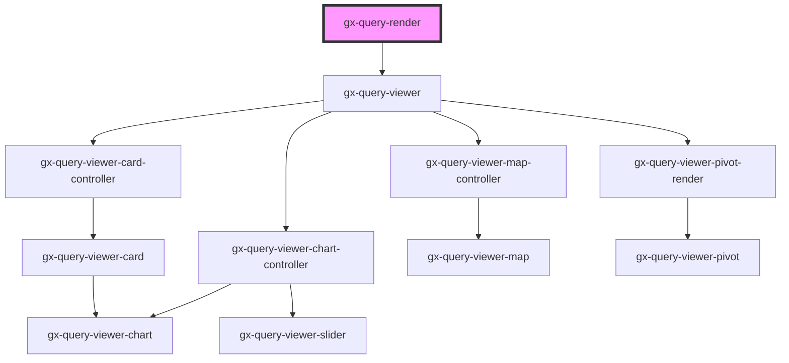

# gx-query-render

<!-- Auto Generated Below -->

## Properties

| Property                   | Attribute             | Description                                                                                                                                                                                                                                                                                          | Type                                                                                                                       | Default           |
| -------------------------- | --------------------- | ---------------------------------------------------------------------------------------------------------------------------------------------------------------------------------------------------------------------------------------------------------------------------------------------------- | -------------------------------------------------------------------------------------------------------------------------- | ----------------- |
| `apiKey`                   | `api-key`             | This is GxQuery authentication key. It will required when property useGxQuery = true                                                                                                                                                                                                                 | `string`                                                                                                                   | `""`              |
| `baseUrl`                  | `base-url`            | API base URL                                                                                                                                                                                                                                                                                         | `string`                                                                                                                   | `""`              |
| `controlName` _(required)_ | `control-name`        | Specifies the name of the control used in the pivot and Table outputs types                                                                                                                                                                                                                          | `string`                                                                                                                   | `undefined`       |
| `data`                     | `data`                | Data for query viewer                                                                                                                                                                                                                                                                                | `string \| { rows: QueryViewerServiceDataRow[]; }`                                                                         | `undefined`       |
| `environment`              | `environment`         | Environment of the project: java or net                                                                                                                                                                                                                                                              | `"java" \| "net"`                                                                                                          | `"net"`           |
| `fetchingDataLabel`        | `fetching-data-label` |                                                                                                                                                                                                                                                                                                      | `"Fetching data"`                                                                                                          | `"Fetching data"` |
| `metadata`                 | `metadata`            | Metadata for query viewer                                                                                                                                                                                                                                                                            | `string \| { textForNullValues: string; axes: QueryViewerServiceMetaDataAxis[]; data: QueryViewerServiceMetaDataData[]; }` | `undefined`       |
| `metadataName`             | `metadata-name`       | This is the name of the metadata (all the queries belong to a certain metadata) the connector will use when useGxquery = true. In this case the connector must be told the query to execute, either by name (via the objectName property) or giving a full serialized query (via the query property) | `""`                                                                                                                       | `""`              |
| `noDataLabel`              | `no-data-label`       |                                                                                                                                                                                                                                                                                                      | `"No Data"`                                                                                                                | `"No Data"`       |
| `query`                    | --                    | Provide the Query properties                                                                                                                                                                                                                                                                         | `QueryViewerBase`                                                                                                          | `undefined`       |
| `saiaToken`                | `saia-token`          | This is GxQuery Saia Token. It will required when property useGxQuery = true                                                                                                                                                                                                                         | `string`                                                                                                                   | `""`              |
| `saiaUserId`               | `saia-user-id`        | This is GxQuery Saia User ID (optional). It will use when property useGxQuery = true                                                                                                                                                                                                                 | `string`                                                                                                                   | `""`              |
| `useGxquery`               | `use-gxquery`         | True to tell the controller to connect use GXquery as a queries repository                                                                                                                                                                                                                           | `boolean`                                                                                                                  | `true`            |

## Shadow Parts

| Part                 | Description |
| -------------------- | ----------- |
| `"message-fetching"` |             |
| `"message-nodata"`   |             |
| `"wrapper"`          |             |

## Dependencies

### Depends on

- [gx-query-viewer](../../query-viewer)

### Graph

----------------------------------------------

*Built with [StencilJS](https://stenciljs.com/)*
