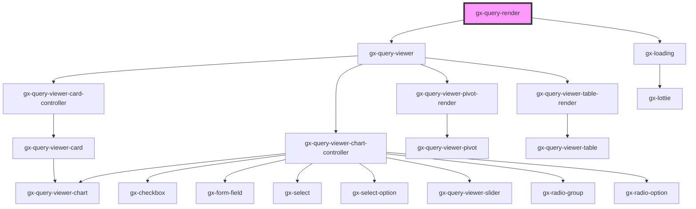

# gx-query-render

<!-- Auto Generated Below -->

## Properties

| Property            | Attribute             | Description                                                                                                                                                                                                                                                                                          | Type                                                                                                                       | Default                     |
| ------------------- | --------------------- | ---------------------------------------------------------------------------------------------------------------------------------------------------------------------------------------------------------------------------------------------------------------------------------------------------- | -------------------------------------------------------------------------------------------------------------------------- | --------------------------- |
| `baseUrl`           | `base-url`            | Base URL of the server                                                                                                                                                                                                                                                                               | `string`                                                                                                                   | `process.env.BASE_URL`      |
| `data`              | `data`                | Data for query viewer                                                                                                                                                                                                                                                                                | `string \| { Rows: QueryViewerServiceDataRow[]; }`                                                                         | `undefined`                 |
| `environment`       | `environment`         | Environment of the project: java or net                                                                                                                                                                                                                                                              | `"java" \| "net"`                                                                                                          | `"net"`                     |
| `fetchingDataLabel` | `fetching-data-label` |                                                                                                                                                                                                                                                                                                      | `"Fetching data"`                                                                                                          | `"Fetching data"`           |
| `metadata`          | `metadata`            | Metadata for query viewer                                                                                                                                                                                                                                                                            | `string \| { TextForNullValues: string; Axes: QueryViewerServiceMetaDataAxis[]; Data: QueryViewerServiceMetaDataData[]; }` | `undefined`                 |
| `metadataName`      | `metadata-name`       | This is the name of the metadata (all the queries belong to a certain metadata) the connector will use when useGxquery = true. In this case the connector must be told the query to execute, either by name (via the objectName property) or giving a full serialized query (via the query property) | `string`                                                                                                                   | `process.env.METADATA_NAME` |
| `noDataLabel`       | `no-data-label`       |                                                                                                                                                                                                                                                                                                      | `"No Data"`                                                                                                                | `"No Data"`                 |
| `query`             | --                    | Provide the Query properties                                                                                                                                                                                                                                                                         | `QueryViewerBase`                                                                                                          | `undefined`                 |
| `useGxquery`        | `use-gxquery`         | True to tell the controller to connect use GXquery as a queries repository                                                                                                                                                                                                                           | `boolean`                                                                                                                  | `true`                      |

## Shadow Parts

| Part                 | Description |
| -------------------- | ----------- |
| `"message-fetching"` |             |
| `"message-nodata"`   |             |
| `"wrapper"`          |             |

## Dependencies

### Depends on

- [gx-query-viewer](../../query-viewer)
- gx-loading

### Graph

----------------------------------------------

*Built with [StencilJS](https://stenciljs.com/)*
