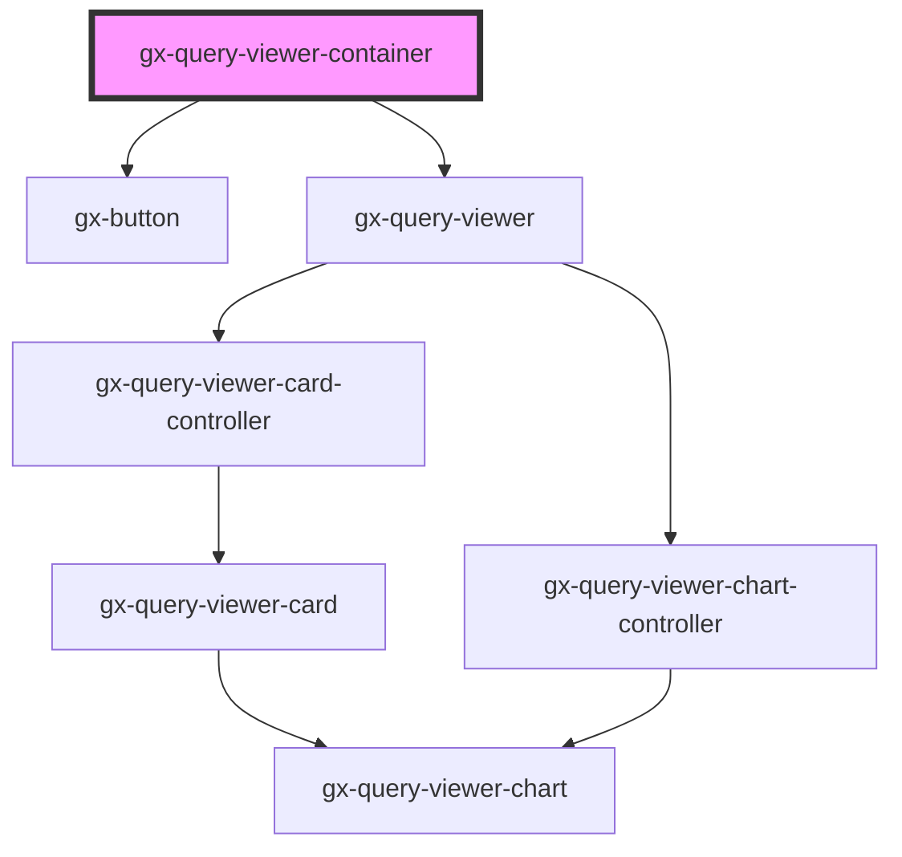

# gx-query-viewer-container

<!-- Auto Generated Below -->

## Properties

| Property    | Attribute    | Description                                    | Type     | Default     |
| ----------- | ------------ | ---------------------------------------------- | -------- | ----------- |
| `mainTitle` | `main-title` | This property specifies the items of the chat. | `string` | `undefined` |

## Events

| Event              | Description | Type                                                                            |
| ------------------ | ----------- | ------------------------------------------------------------------------------- |
| `gxQuerySaveQuery` |             | `CustomEvent<{ id: number; title: string; fixed: boolean; modified: string; }>` |

## Dependencies

### Depends on

- gx-button
- [gx-query-viewer](../../query-viewer)

### Graph

----------------------------------------------

*Built with [StencilJS](https://stenciljs.com/)*
