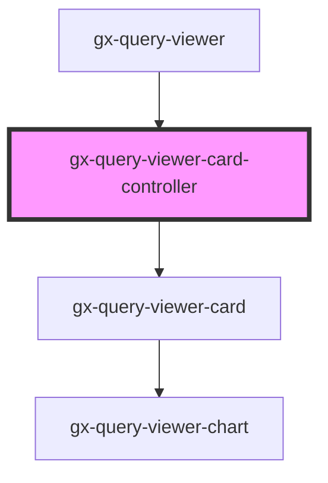

# gx-query-viewer-card-controller

<!-- Auto Generated Below -->

## Properties

| Property           | Attribute           | Description                                                                                                     | Type                                                                                                                                                                                                                                                                                                                                                                             | Default                                    |
| ------------------ | ------------------- | --------------------------------------------------------------------------------------------------------------- | -------------------------------------------------------------------------------------------------------------------------------------------------------------------------------------------------------------------------------------------------------------------------------------------------------------------------------------------------------------------------------- | ------------------------------------------ |
| `includeMaxMin`    | `include-max-min`   | Specifies whether to include the maximum and minimum values in the series.                                      | `boolean`                                                                                                                                                                                                                                                                                                                                                                        | `false`                                    |
| `includeSparkline` | `include-sparkline` | Specifies whether to include a sparkline chart for the values or not.                                           | `boolean`                                                                                                                                                                                                                                                                                                                                                                        | `false`                                    |
| `includeTrend`     | `include-trend`     | Specifies whether to include a trend mark for the values or not.                                                | `boolean`                                                                                                                                                                                                                                                                                                                                                                        | `false`                                    |
| `orientation`      | `orientation`       | Specifies whether to arrange the attributes horizontally or vertically when than one data attribute is present. | `QueryViewerOrientation.Horizontal \| QueryViewerOrientation.Vertical`                                                                                                                                                                                                                                                                                                           | `QueryViewerOrientation.Horizontal`        |
| `serviceResponse`  | --                  | Specifies the metadata and data that the control will use to render.                                            | `{ MetaData: QueryViewerServiceMetaData; Data: QueryViewerServiceData; }`                                                                                                                                                                                                                                                                                                        | `undefined`                                |
| `showDataAs`       | `show-data-as`      | Specifies whether to show the actual values, the values as a percentage of the target values, or both.          | `QueryViewerShowDataAs.Percentages \| QueryViewerShowDataAs.Values \| QueryViewerShowDataAs.ValuesAndPercentages`                                                                                                                                                                                                                                                                | `QueryViewerShowDataAs.Values`             |
| `trendPeriod`      | `trend-period`      | If `includeTrend == true`, this attribute specifies the period of time to calculate the trend.                  | `QueryViewerTrendPeriod.LastDay \| QueryViewerTrendPeriod.LastHour \| QueryViewerTrendPeriod.LastMinute \| QueryViewerTrendPeriod.LastMonth \| QueryViewerTrendPeriod.LastQuarter \| QueryViewerTrendPeriod.LastSecond \| QueryViewerTrendPeriod.LastSemester \| QueryViewerTrendPeriod.LastWeek \| QueryViewerTrendPeriod.LastYear \| QueryViewerTrendPeriod.SinceTheBeginning` | `QueryViewerTrendPeriod.SinceTheBeginning` |

## Dependencies

### Used by

 - [gx-query-viewer](../../query-viewer)

### Depends on

- [gx-query-viewer-card](..)

### Graph

----------------------------------------------

*Built with [StencilJS](https://stenciljs.com/)*
