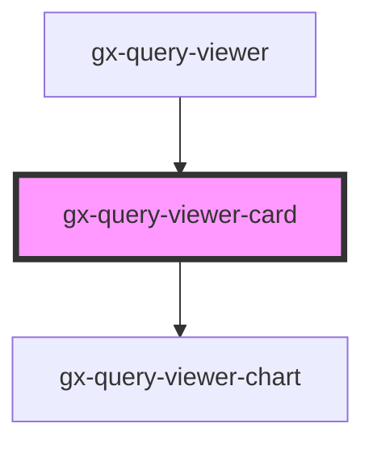

# gx-query-viewer-card

<!-- Auto Generated Below -->

## Properties

| Property           | Attribute             | Description                                                                                                                  | Type                                                                                                                                                                      | Default                 |
| ------------------ | --------------------- | ---------------------------------------------------------------------------------------------------------------------------- | ------------------------------------------------------------------------------------------------------------------------------------------------------------------------- | ----------------------- |
| `axis`             | --                    | Axis.                                                                                                                        | `ElementValue`                                                                                                                                                            | `undefined`             |
| `datum`            | --                    | Datum.                                                                                                                       | `ElementValue`                                                                                                                                                            | `undefined`             |
| `description`      | `description`         | Description, describe the content or purpose of the element set as Datum in the query object.                                | `string`                                                                                                                                                                  | `undefined`             |
| `includeMaxAndMin` | `include-max-and-min` | IncludeMaxAndMin, specifies whether to include the maximum and minimum values in the series.                                 | `boolean`                                                                                                                                                                 | `false`                 |
| `includeSparkline` | `include-sparkline`   | IncludeSparkline, specifies whether to include a sparkline chart for the values or not.                                      | `boolean`                                                                                                                                                                 | `false`                 |
| `includeTrend`     | `include-trend`       | IncludeTrend, specifies whether to include a trend mark for the values or not.                                               | `boolean`                                                                                                                                                                 | `false`                 |
| `maxValue`         | `max-value`           | maxValue, specifies the maximum value in the series.                                                                         | `number`                                                                                                                                                                  | `3905.71`               |
| `minValue`         | `min-value`           | minValue, specifies the minimum value in the series.                                                                         | `number`                                                                                                                                                                  | `1802.52`               |
| `orientation`      | `orientation`         | Orientation, specifies whether to arrange the attributes horizontally or vertically when than one data attribute is present. | `"Horizontal" \| "Vertical"`                                                                                                                                              | `"Horizontal"`          |
| `showDataAs`       | `show-data-as`        | ShowDataAs, specifies whether to show the actual values, the values as a percentage of the target values, or both.           | `"Percentages" \| "Values and Percentages" \| "Values"`                                                                                                                   | `"Values"`              |
| `trendPeriod`      | `trend-period`        | If includeTrend == True, TrendPeriod specifies the period of time to calculate the trend.                                    | `"Last day" \| "Last hour" \| "Last minute" \| "Last month" \| "Last quarter" \| "Last second" \| "Last semester" \| "Last week" \| "Last year" \| "Since the beginning"` | `"Since the beginning"` |
| `value`            | `value`               | Value, specifies the value to show in the card.                                                                              | `string`                                                                                                                                                                  | `undefined`             |

## Events

| Event            | Description                                                                                      | Type               |
| ---------------- | ------------------------------------------------------------------------------------------------ | ------------------ |
| `itemClickEvent` | ItemClickEvent, executes actions when this event is triggered after clicking on a query element. | `CustomEvent<any>` |

## Shadow Parts

| Part              | Description |
| ----------------- | ----------- |
| `"max-min-title"` |             |
| `"max-min-value"` |             |
| `"title"`         |             |
| `"trend"`         |             |
| `"value"`         |             |

## Dependencies

### Used by

 - [gx-query-viewer](../query-viewer)

### Depends on

- [gx-query-viewer-chart](../query-viewer-chart)

### Graph

----------------------------------------------

*Built with [StencilJS](https://stenciljs.com/)*
