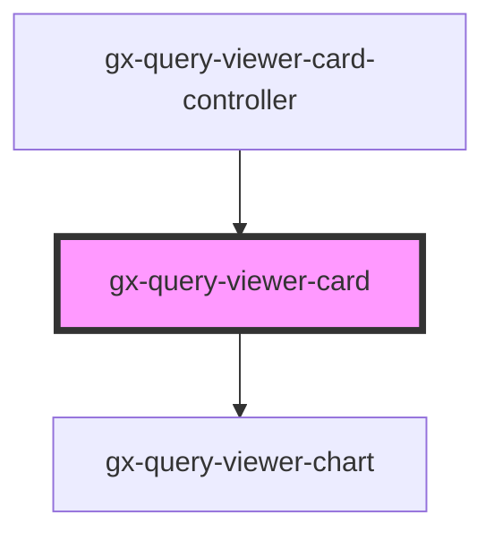

# gx-query-viewer-card

<!-- Auto Generated Below -->

## Properties

| Property           | Attribute           | Description                                                                      | Type                                                            | Default         |
| ------------------ | ------------------- | -------------------------------------------------------------------------------- | --------------------------------------------------------------- | --------------- |
| `description`      | `description`       | Describe the content or purpose of the element set as Datum in the query object. | `string`                                                        | `undefined`     |
| `includeMaxMin`    | `include-max-min`   | Specifies whether to include the maximum and minimum values in the series.       | `boolean`                                                       | `false`         |
| `includeSparkline` | `include-sparkline` | Specifies whether to include a sparkline chart for the values or not.            | `boolean`                                                       | `false`         |
| `includeTrend`     | `include-trend`     | Specifies whether to include a trend mark for the values or not.                 | `boolean`                                                       | `false`         |
| `maxValue`         | `max-value`         | Specifies the maximum value in the series.                                       | `string`                                                        | `""`            |
| `minValue`         | `min-value`         | Specifies the minimum value in the series.                                       | `string`                                                        | `""`            |
| `seriesData`       | --                  | Specifies the data used for the series of the sparkline.                         | `number[][]`                                                    | `[]`            |
| `trendIcon`        | `trend-icon`        | Specifies the icon used for the trend.                                           | `"drag_handle" \| "keyboard_arrow_down" \| "keyboard_arrow_up"` | `"drag_handle"` |
| `value`            | `value`             | Specifies the value to show in the card.                                         | `string`                                                        | `undefined`     |

## Events

| Event            | Description                                                                                      | Type               |
| ---------------- | ------------------------------------------------------------------------------------------------ | ------------------ |
| `itemClickEvent` | ItemClickEvent, executes actions when this event is triggered after clicking on a query element. | `CustomEvent<any>` |

## Shadow Parts

| Part              | Description |
| ----------------- | ----------- |
| `"max-min-title"` |             |
| `"max-min-value"` |             |
| `"title"`         |             |
| `"trend"`         |             |
| `"value"`         |             |

## Dependencies

### Used by

 - [gx-query-viewer-card-controller](controller)

### Depends on

- [gx-query-viewer-chart](../query-viewer-chart)

### Graph

----------------------------------------------

*Built with [StencilJS](https://stenciljs.com/)*
