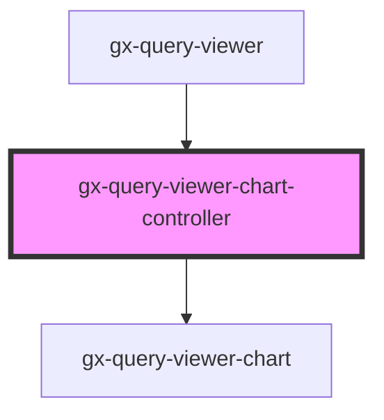

# gx-query-viewer-chart-controller

<!-- Auto Generated Below -->

## Properties

| Property                  | Attribute                     | Description                                                                 | Type                                                                                                                                                                                                                                                                                                                                                                                                                                                                                                                         | Default     |
| ------------------------- | ----------------------------- | --------------------------------------------------------------------------- | ---------------------------------------------------------------------------------------------------------------------------------------------------------------------------------------------------------------------------------------------------------------------------------------------------------------------------------------------------------------------------------------------------------------------------------------------------------------------------------------------------------------------------- | ----------- |
| `allowSelection`          | `allow-selection`             | Allow selection                                                             | `boolean`                                                                                                                                                                                                                                                                                                                                                                                                                                                                                                                    | `undefined` |
| `chartType`               | `chart-type`                  | If type == Chart, this is the chart type: Bar, Pie, Timeline, etc...        | `QueryViewerChartType`                                                                                                                                                                                                                                                                                                                                                                                                                                                                                                       | `undefined` |
| `cssClass`                | `css-class`                   | A CSS class to set as the `gx-query-viewer-chart-controller` element class. | `string`                                                                                                                                                                                                                                                                                                                                                                                                                                                                                                                     | `undefined` |
| `plotSeries`              | `plot-series`                 | Timeline                                                                    | `QueryViewerPlotSeries.InSeparateCharts \| QueryViewerPlotSeries.InTheSameChart`                                                                                                                                                                                                                                                                                                                                                                                                                                             | `undefined` |
| `queryTitle`              | `query-title`                 | Title of the QueryViewer                                                    | `string`                                                                                                                                                                                                                                                                                                                                                                                                                                                                                                                     | `undefined` |
| `serviceResponse`         | --                            | Specifies the metadata and data that the control will use to render.        | `{ MetaData: QueryViewerServiceMetaData; Data: QueryViewerServiceData; }`                                                                                                                                                                                                                                                                                                                                                                                                                                                    | `undefined` |
| `showValues`              | `show-values`                 | if true show values on the graph                                            | `boolean`                                                                                                                                                                                                                                                                                                                                                                                                                                                                                                                    | `undefined` |
| `translations`            | --                            | For translate the labels of the outputs                                     | `{ GXPL_QViewerSinceTheBeginningTrend: string; GXPL_QViewerLastYearTrend: string; GXPL_QViewerLastSemesterTrend: string; GXPL_QViewerLastQuarterTrend: string; GXPL_QViewerLastMonthTrend: string; GXPL_QViewerLastWeekTrend: string; GXPL_QViewerLastDayTrend: string; GXPL_QViewerLastHourTrend: string; GXPL_QViewerLastMinuteTrend: string; GXPL_QViewerLastSecondTrend: string; GXPL_QViewerCardMinimum: string; GXPL_QViewerCardMaximum: string; GXPL_QViewerNoDatetimeAxis: string; GXPL_QViewerNoMapAxis: string; }` | `undefined` |
| `xAxisIntersectionAtZero` | `x-axis-intersection-at-zero` | if true the x Axes intersect at zero                                        | `boolean`                                                                                                                                                                                                                                                                                                                                                                                                                                                                                                                    | `undefined` |
| `xAxisLabels`             | `x-axis-labels`               | Labels for XAxis                                                            | `QueryViewerXAxisLabels.Horizontally \| QueryViewerXAxisLabels.Rotated30 \| QueryViewerXAxisLabels.Rotated45 \| QueryViewerXAxisLabels.Rotated60 \| QueryViewerXAxisLabels.Vertically`                                                                                                                                                                                                                                                                                                                                       | `undefined` |
| `yAxisTitle`              | `y-axis-title`                | Y Axis title                                                                | `string`                                                                                                                                                                                                                                                                                                                                                                                                                                                                                                                     | `undefined` |

## Dependencies

### Used by

 - [gx-query-viewer](../../query-viewer)

### Depends on

- [gx-query-viewer-chart](..)

### Graph

----------------------------------------------

*Built with [StencilJS](https://stenciljs.com/)*
