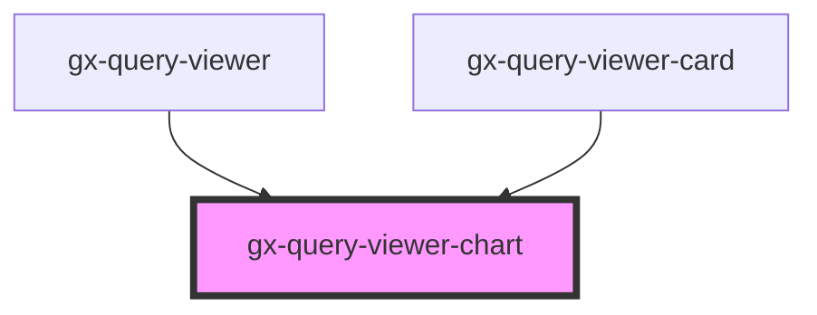

# gx-query-viewer-chart

<!-- Auto Generated Below -->

## Properties

| Property         | Attribute | Description                                                                                                           | Type                  | Default     |
| ---------------- | --------- | --------------------------------------------------------------------------------------------------------------------- | --------------------- | ----------- |
| `chartOptions`   | --        | Title that will be displayed on top of the query                                                                      | `ChartOptions`        | `undefined` |
| `chartTitle`     | --        | Name of the element                                                                                                   | `TitleOptions`        | `undefined` |
| `legendOptions`  | --        | Options of the tooltip, the tooltip appears when hovering over a point in a series.                                   | `LegendOptions`       | `undefined` |
| `plotOptions`    | --        | Options of the legend, the legend displays the series in a chart with a predefined symbol and the name of the series. | `PlotOptions`         | `undefined` |
| `seriesOptions`  | --        | Options of the X axis (usually this is the horizontal axis).                                                          | `SeriesOptionsType[]` | `undefined` |
| `tooltipOptions` | --        | Options of the chart.                                                                                                 | `TooltipOptions`      | `undefined` |
| `xaxisOptions`   | --        | Options of the Y axis (usually this is the vertical axis).                                                            | `XAxisOptions`        | `undefined` |
| `yaxisOptions`   | --        | Options of the plot for each series type chart.                                                                       | `YAxisOptions`        | `undefined` |

## Dependencies

### Used by

 - [gx-query-viewer](../query-viewer)
 - [gx-query-viewer-card](../query-viewer-card)

### Graph

----------------------------------------------

*Built with [StencilJS](https://stenciljs.com/)*
