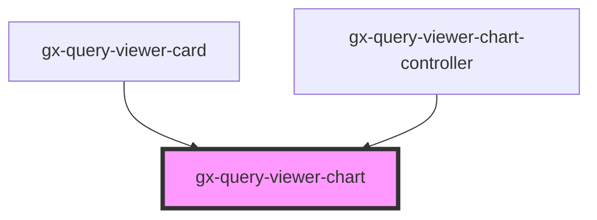

# gx-query-viewer-chart

<!-- Auto Generated Below -->

## Properties

| Property                  | Attribute                     | Description                                                                                                           | Type                                                                                                                                                                                                                                                                                                                                                                                                                                                                                                                         | Default     |
| ------------------------- | ----------------------------- | --------------------------------------------------------------------------------------------------------------------- | ---------------------------------------------------------------------------------------------------------------------------------------------------------------------------------------------------------------------------------------------------------------------------------------------------------------------------------------------------------------------------------------------------------------------------------------------------------------------------------------------------------------------------- | ----------- |
| `chartOptions`            | --                            | Title that will be displayed on top of the query                                                                      | `ChartOptions`                                                                                                                                                                                                                                                                                                                                                                                                                                                                                                               | `undefined` |
| `chartTitle`              | --                            | Name of the element                                                                                                   | `TitleOptions`                                                                                                                                                                                                                                                                                                                                                                                                                                                                                                               | `undefined` |
| `chartType`               | `chart-type`                  | Option of the chartType used to visualize and represent data.                                                         | `QueryViewerChartType`                                                                                                                                                                                                                                                                                                                                                                                                                                                                                                       | `undefined` |
| `legendOptions`           | --                            | Options of the tooltip, the tooltip appears when hovering over a point in a series.                                   | `LegendOptions`                                                                                                                                                                                                                                                                                                                                                                                                                                                                                                              | `undefined` |
| `paneOptions`             | --                            | Options of the chart.                                                                                                 | `PaneOptions`                                                                                                                                                                                                                                                                                                                                                                                                                                                                                                                | `undefined` |
| `plotOptions`             | --                            | Options of the legend, the legend displays the series in a chart with a predefined symbol and the name of the series. | `PlotOptions`                                                                                                                                                                                                                                                                                                                                                                                                                                                                                                                | `undefined` |
| `plotSeries`              | `plot-series`                 | Specifies if the chart series are plotted together in the same chart or alone in separate charts.                     | `QueryViewerPlotSeries.InSeparateCharts \| QueryViewerPlotSeries.InTheSameChart`                                                                                                                                                                                                                                                                                                                                                                                                                                             | `undefined` |
| `seriesOptions`           | --                            | Options of the X axis (usually this is the horizontal axis).                                                          | `SeriesOptionsType[]`                                                                                                                                                                                                                                                                                                                                                                                                                                                                                                        | `undefined` |
| `showValues`              | `show-values`                 | Specifies whether the values for the data elements are shown in the chart or not.                                     | `boolean`                                                                                                                                                                                                                                                                                                                                                                                                                                                                                                                    | `undefined` |
| `subtitleOptions`         | --                            | Name of the element                                                                                                   | `SubtitleOptions`                                                                                                                                                                                                                                                                                                                                                                                                                                                                                                            | `undefined` |
| `tooltipOptions`          | --                            | Options of the chart.                                                                                                 | `TooltipOptions`                                                                                                                                                                                                                                                                                                                                                                                                                                                                                                             | `undefined` |
| `translations`            | --                            | For translate the labels of the outputs                                                                               | `{ GXPL_QViewerSinceTheBeginningTrend: string; GXPL_QViewerLastYearTrend: string; GXPL_QViewerLastSemesterTrend: string; GXPL_QViewerLastQuarterTrend: string; GXPL_QViewerLastMonthTrend: string; GXPL_QViewerLastWeekTrend: string; GXPL_QViewerLastDayTrend: string; GXPL_QViewerLastHourTrend: string; GXPL_QViewerLastMinuteTrend: string; GXPL_QViewerLastSecondTrend: string; GXPL_QViewerCardMinimum: string; GXPL_QViewerCardMaximum: string; GXPL_QViewerNoDatetimeAxis: string; GXPL_QViewerNoMapAxis: string; }` | `undefined` |
| `xAxisIntersectionAtZero` | `x-axis-intersection-at-zero` | Specifies whether the X axis intersects the Y axis at zero or the intersection point is automatically calculated.     | `boolean`                                                                                                                                                                                                                                                                                                                                                                                                                                                                                                                    | `undefined` |
| `xAxisLabels`             | `x-axis-labels`               | Specifies if the labels in the X axis of a chart are shown horizontally or vertically.                                | `QueryViewerXAxisLabels.Horizontally \| QueryViewerXAxisLabels.Rotated30 \| QueryViewerXAxisLabels.Rotated45 \| QueryViewerXAxisLabels.Rotated60 \| QueryViewerXAxisLabels.Vertically`                                                                                                                                                                                                                                                                                                                                       | `undefined` |
| `xAxisTitle`              | `x-axis-title`                | X axis title, if specified.                                                                                           | `string`                                                                                                                                                                                                                                                                                                                                                                                                                                                                                                                     | `undefined` |
| `xaxisOptions`            | --                            | Options of the Y axis (usually this is the vertical axis).                                                            | `XAxisOptions \| XAxisOptions[]`                                                                                                                                                                                                                                                                                                                                                                                                                                                                                             | `undefined` |
| `yAxisTitle`              | `y-axis-title`                | Y axis title, if specified.                                                                                           | `string`                                                                                                                                                                                                                                                                                                                                                                                                                                                                                                                     | `undefined` |
| `yaxisOptions`            | --                            | Options of the plot for each series type chart.                                                                       | `YAxisOptions \| YAxisOptions[]`                                                                                                                                                                                                                                                                                                                                                                                                                                                                                             | `undefined` |

## Methods

### `addSeries(series: SeriesLineOptions) => Promise<Highcharts.Series>`

get the current extremes for the axis.

#### Returns

Type: `Promise<Series>`

### `getExtremes() => Promise<Highcharts.ExtremesObject>`

get the current extremes for the axis.

#### Returns

Type: `Promise<ExtremesObject>`

### `setExtremes(minDate: number, maxDate: number, redraw: boolean) => Promise<void>`

set the current extremes for the axis.

#### Returns

Type: `Promise<void>`

### `zoomOut() => Promise<void>`

zoom out for the chart

#### Returns

Type: `Promise<void>`

## Dependencies

### Used by

- [gx-query-viewer-card](../query-viewer-card)
- [gx-query-viewer-chart-controller](controller)

### Graph

---

_Built with [StencilJS](https://stenciljs.com/)_
