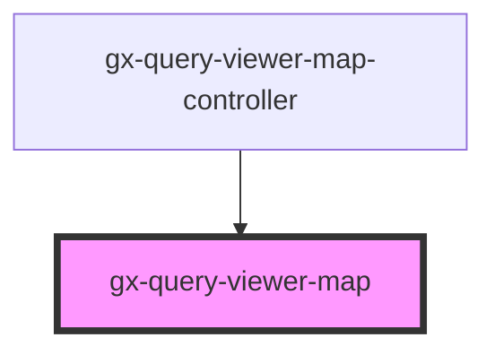

# gx-query-viewer-map

<!-- Auto Generated Below -->

## Properties

| Property       | Attribute       | Description                                                        | Type                                                                                                                                                                                                                                                                                                                                                                                                                                                                                                                                                                                                                                                                                                                                                                                                                                                                                                                                                                                                                                                                                                                                                                                                                                                                                                                                                                                                                                                                                                                                                                                                                                                                                                                                                                                                                                                                                                                                                                                                                                                                                                                                                                                                                                                                                                                                                                                                                                                                                                                                                                                                                                                                                                                                                                                                                                                                                                                               | Default     |
| -------------- | --------------- | ------------------------------------------------------------------ | ---------------------------------------------------------------------------------------------------------------------------------------------------------------------------------------------------------------------------------------------------------------------------------------------------------------------------------------------------------------------------------------------------------------------------------------------------------------------------------------------------------------------------------------------------------------------------------------------------------------------------------------------------------------------------------------------------------------------------------------------------------------------------------------------------------------------------------------------------------------------------------------------------------------------------------------------------------------------------------------------------------------------------------------------------------------------------------------------------------------------------------------------------------------------------------------------------------------------------------------------------------------------------------------------------------------------------------------------------------------------------------------------------------------------------------------------------------------------------------------------------------------------------------------------------------------------------------------------------------------------------------------------------------------------------------------------------------------------------------------------------------------------------------------------------------------------------------------------------------------------------------------------------------------------------------------------------------------------------------------------------------------------------------------------------------------------------------------------------------------------------------------------------------------------------------------------------------------------------------------------------------------------------------------------------------------------------------------------------------------------------------------------------------------------------------------------------------------------------------------------------------------------------------------------------------------------------------------------------------------------------------------------------------------------------------------------------------------------------------------------------------------------------------------------------------------------------------------------------------------------------------------------------------------------------------- | ----------- |
| `continent`    | `continent`     | If region = Continent, this is the continent to display in the map | `QueryViewerContinent.Africa \| QueryViewerContinent.Antarctica \| QueryViewerContinent.Asia \| QueryViewerContinent.Europe \| QueryViewerContinent.NorthAmerica \| QueryViewerContinent.Oceania \| QueryViewerContinent.SouthAmerica`                                                                                                                                                                                                                                                                                                                                                                                                                                                                                                                                                                                                                                                                                                                                                                                                                                                                                                                                                                                                                                                                                                                                                                                                                                                                                                                                                                                                                                                                                                                                                                                                                                                                                                                                                                                                                                                                                                                                                                                                                                                                                                                                                                                                                                                                                                                                                                                                                                                                                                                                                                                                                                                                                             | `undefined` |
| `country`      | `country`       | If region = Country, this is the country to display in the map     | `QueryViewerCountry`                                                                                                                                                                                                                                                                                                                                                                                                                                                                                                                                                                                                                                                                                                                                                                                                                                                                                                                                                                                                                                                                                                                                                                                                                                                                                                                                                                                                                                                                                                                                                                                                                                                                                                                                                                                                                                                                                                                                                                                                                                                                                                                                                                                                                                                                                                                                                                                                                                                                                                                                                                                                                                                                                                                                                                                                                                                                                                               | `undefined` |
| `cssClass`     | `css-class`     | A CSS class to set as the element class.                           | `string`                                                                                                                                                                                                                                                                                                                                                                                                                                                                                                                                                                                                                                                                                                                                                                                                                                                                                                                                                                                                                                                                                                                                                                                                                                                                                                                                                                                                                                                                                                                                                                                                                                                                                                                                                                                                                                                                                                                                                                                                                                                                                                                                                                                                                                                                                                                                                                                                                                                                                                                                                                                                                                                                                                                                                                                                                                                                                                                           | `undefined` |
| `data`         | --              | The Data module provides a simplified interface for adding data.   | `(number \| PointOptionsObject \| [string, number])[]`                                                                                                                                                                                                                                                                                                                                                                                                                                                                                                                                                                                                                                                                                                                                                                                                                                                                                                                                                                                                                                                                                                                                                                                                                                                                                                                                                                                                                                                                                                                                                                                                                                                                                                                                                                                                                                                                                                                                                                                                                                                                                                                                                                                                                                                                                                                                                                                                                                                                                                                                                                                                                                                                                                                                                                                                                                                                             | `undefined` |
| `description`  | `description`   | Description of the QueryViewer                                     | `string`                                                                                                                                                                                                                                                                                                                                                                                                                                                                                                                                                                                                                                                                                                                                                                                                                                                                                                                                                                                                                                                                                                                                                                                                                                                                                                                                                                                                                                                                                                                                                                                                                                                                                                                                                                                                                                                                                                                                                                                                                                                                                                                                                                                                                                                                                                                                                                                                                                                                                                                                                                                                                                                                                                                                                                                                                                                                                                                           | `undefined` |
| `footerFormat` | `footer-format` | A string to append to the tooltip format.                          | `string`                                                                                                                                                                                                                                                                                                                                                                                                                                                                                                                                                                                                                                                                                                                                                                                                                                                                                                                                                                                                                                                                                                                                                                                                                                                                                                                                                                                                                                                                                                                                                                                                                                                                                                                                                                                                                                                                                                                                                                                                                                                                                                                                                                                                                                                                                                                                                                                                                                                                                                                                                                                                                                                                                                                                                                                                                                                                                                                           | `undefined` |
| `headerFormat` | `header-format` | The HTML of the tooltip header line                                | `string`                                                                                                                                                                                                                                                                                                                                                                                                                                                                                                                                                                                                                                                                                                                                                                                                                                                                                                                                                                                                                                                                                                                                                                                                                                                                                                                                                                                                                                                                                                                                                                                                                                                                                                                                                                                                                                                                                                                                                                                                                                                                                                                                                                                                                                                                                                                                                                                                                                                                                                                                                                                                                                                                                                                                                                                                                                                                                                                           | `undefined` |
| `mapType`      | `map-type`      | This is the map type: Bubble or Choropleth                         | `QueryViewerMapType.Bubble \| QueryViewerMapType.Choropleth`                                                                                                                                                                                                                                                                                                                                                                                                                                                                                                                                                                                                                                                                                                                                                                                                                                                                                                                                                                                                                                                                                                                                                                                                                                                                                                                                                                                                                                                                                                                                                                                                                                                                                                                                                                                                                                                                                                                                                                                                                                                                                                                                                                                                                                                                                                                                                                                                                                                                                                                                                                                                                                                                                                                                                                                                                                                                       | `undefined` |
| `pointFormat`  | `point-format`  | The HTML of the point's line in the tooltip                        | `string`                                                                                                                                                                                                                                                                                                                                                                                                                                                                                                                                                                                                                                                                                                                                                                                                                                                                                                                                                                                                                                                                                                                                                                                                                                                                                                                                                                                                                                                                                                                                                                                                                                                                                                                                                                                                                                                                                                                                                                                                                                                                                                                                                                                                                                                                                                                                                                                                                                                                                                                                                                                                                                                                                                                                                                                                                                                                                                                           | `undefined` |
| `queryTitle`   | `query-title`   | Title of the QueryViewer                                           | `string`                                                                                                                                                                                                                                                                                                                                                                                                                                                                                                                                                                                                                                                                                                                                                                                                                                                                                                                                                                                                                                                                                                                                                                                                                                                                                                                                                                                                                                                                                                                                                                                                                                                                                                                                                                                                                                                                                                                                                                                                                                                                                                                                                                                                                                                                                                                                                                                                                                                                                                                                                                                                                                                                                                                                                                                                                                                                                                                           | `undefined` |
| `region`       | `region`        | This is the region to display in the map                           | `QueryViewerRegion.Continent \| QueryViewerRegion.Country \| QueryViewerRegion.World`                                                                                                                                                                                                                                                                                                                                                                                                                                                                                                                                                                                                                                                                                                                                                                                                                                                                                                                                                                                                                                                                                                                                                                                                                                                                                                                                                                                                                                                                                                                                                                                                                                                                                                                                                                                                                                                                                                                                                                                                                                                                                                                                                                                                                                                                                                                                                                                                                                                                                                                                                                                                                                                                                                                                                                                                                                              | `undefined` |
| `series`       | --              | Series options for specific data and the data itself.              | `SeriesAbandsOptions \| SeriesAdOptions \| SeriesAoOptions \| SeriesApoOptions \| SeriesArcdiagramOptions \| SeriesAreaOptions \| SeriesArearangeOptions \| SeriesAreasplineOptions \| SeriesAreasplinerangeOptions \| SeriesAroonOptions \| SeriesAroonoscillatorOptions \| SeriesAtrOptions \| SeriesBarOptions \| SeriesBbOptions \| SeriesBellcurveOptions \| SeriesBoxplotOptions \| SeriesBubbleOptions \| SeriesBulletOptions \| SeriesCandlestickOptions \| SeriesCciOptions \| SeriesChaikinOptions \| SeriesCmfOptions \| SeriesCmoOptions \| SeriesColumnOptions \| SeriesColumnpyramidOptions \| SeriesColumnrangeOptions \| SeriesCylinderOptions \| SeriesDemaOptions \| SeriesDependencywheelOptions \| SeriesDisparityindexOptions \| SeriesDmiOptions \| SeriesDpoOptions \| SeriesDumbbellOptions \| SeriesEmaOptions \| SeriesErrorbarOptions \| SeriesFlagsOptions \| SeriesFlowmapOptions \| SeriesFunnel3dOptions \| SeriesFunnelOptions \| SeriesGanttOptions \| SeriesGaugeOptions \| SeriesGeoheatmapOptions \| SeriesHeatmapOptions \| SeriesHeikinashiOptions \| SeriesHistogramOptions \| SeriesHlcOptions \| SeriesHollowcandlestickOptions \| SeriesIkhOptions \| SeriesItemOptions \| SeriesKeltnerchannelsOptions \| SeriesKlingerOptions \| SeriesLinearregressionangleOptions \| SeriesLinearregressioninterceptOptions \| SeriesLinearregressionOptions \| SeriesLinearregressionslopeOptions \| SeriesLineOptions \| SeriesLollipopOptions \| SeriesMacdOptions \| SeriesMapbubbleOptions \| SeriesMaplineOptions \| SeriesMapOptions \| SeriesMappointOptions \| SeriesMfiOptions \| SeriesMomentumOptions \| SeriesNatrOptions \| SeriesNetworkgraphOptions \| SeriesObvOptions \| SeriesOhlcOptions \| SeriesOrganizationOptions \| SeriesPackedbubbleOptions \| SeriesParetoOptions \| SeriesPcOptions \| SeriesPictorialOptions \| SeriesPieOptions \| SeriesPivotpointsOptions \| SeriesPolygonOptions \| SeriesPpoOptions \| SeriesPriceenvelopesOptions \| SeriesPsarOptions \| SeriesPyramid3dOptions \| SeriesPyramidOptions \| SeriesRocOptions \| SeriesRsiOptions \| SeriesSankeyOptions \| SeriesScatter3dOptions \| SeriesScatterOptions \| SeriesSlowstochasticOptions \| SeriesSmaOptions \| SeriesSolidgaugeOptions \| SeriesSplineOptions \| SeriesStochasticOptions \| SeriesStreamgraphOptions \| SeriesSunburstOptions \| SeriesSupertrendOptions \| SeriesTemaOptions \| SeriesTiledwebmapOptions \| SeriesTilemapOptions \| SeriesTimelineOptions \| SeriesTreegraphOptions \| SeriesTreemapOptions \| SeriesTrendlineOptions \| SeriesTrixOptions \| SeriesVariablepieOptions \| SeriesVariwideOptions \| SeriesVbpOptions \| SeriesVectorOptions \| SeriesVennOptions \| SeriesVwapOptions \| SeriesWaterfallOptions \| SeriesWilliamsrOptions \| SeriesWindbarbOptions \| SeriesWmaOptions \| SeriesWordcloudOptions \| SeriesXrangeOptions \| SeriesZigzagOptions` | `undefined` |
| `topology`     | --              | Map Data for series, in terms of a GeoJSON or TopoJSON object      | `GeoJSON \| object`                                                                                                                                                                                                                                                                                                                                                                                                                                                                                                                                                                                                                                                                                                                                                                                                                                                                                                                                                                                                                                                                                                                                                                                                                                                                                                                                                                                                                                                                                                                                                                                                                                                                                                                                                                                                                                                                                                                                                                                                                                                                                                                                                                                                                                                                                                                                                                                                                                                                                                                                                                                                                                                                                                                                                                                                                                                                                                                | `undefined` |

## Events

| Event              | Description | Type                                                                     |
| ------------------ | ----------- | ------------------------------------------------------------------------ |
| `mapItemClick`     |             | `CustomEvent<(this: Point, event: PointClickEventObject) => void>`       |
| `mapItemMouseOut`  |             | `CustomEvent<(this: Point, event: PointClickEventObject) => void>`       |
| `mapItemMouseOver` |             | `CustomEvent<(this: Point, event: PointClickEventObject) => void>`       |
| `mapItemSelect`    |             | `CustomEvent<(this: Point, event: PointInteractionEventObject) => void>` |

## Dependencies

### Used by

 - [gx-query-viewer-map-controller](controller)

### Graph

----------------------------------------------

*Built with [StencilJS](https://stenciljs.com/)*
