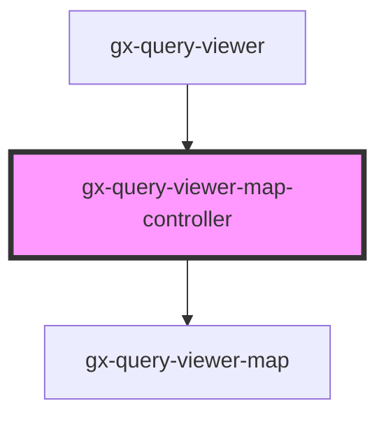

# gx-query-viewer-map-controller

<!-- Auto Generated Below -->

## Properties

| Property           | Attribute            | Description                                                                                                     | Type                                                                                                                                                                                                                                   | Default     |
| ------------------ | -------------------- | --------------------------------------------------------------------------------------------------------------- | -------------------------------------------------------------------------------------------------------------------------------------------------------------------------------------------------------------------------------------- | ----------- |
| `allowPointSelect` | `allow-point-select` | Allow the points to be selected by clicking on the graphic (columns, point markers, pie slices, map areas etc). | `boolean`                                                                                                                                                                                                                              | `false`     |
| `continent`        | `continent`          | If region = Continent, this is the continent to display in the map                                              | `QueryViewerContinent.Africa \| QueryViewerContinent.Antarctica \| QueryViewerContinent.Asia \| QueryViewerContinent.Europe \| QueryViewerContinent.NorthAmerica \| QueryViewerContinent.Oceania \| QueryViewerContinent.SouthAmerica` | `undefined` |
| `country`          | `country`            | If region = Country, this is the country to display in the map                                                  | `QueryViewerCountry`                                                                                                                                                                                                                   | `undefined` |
| `cssClass`         | `css-class`          | A CSS class to set as the `gx-query-viewer-map` element class.                                                  | `string`                                                                                                                                                                                                                               | `undefined` |
| `description`      | `description`        | Description of the QueryViewer                                                                                  | `string`                                                                                                                                                                                                                               | `undefined` |
| `footerFormat`     | `footer-format`      | A string to append to the tooltip format.                                                                       | `string`                                                                                                                                                                                                                               | `undefined` |
| `headerFormat`     | `header-format`      | The HTML of the tooltip header line                                                                             | `string`                                                                                                                                                                                                                               | `undefined` |
| `mapType`          | `map-type`           | This is the map type: Bubble or Choropleth                                                                      | `QueryViewerMapType.Bubble \| QueryViewerMapType.Choropleth`                                                                                                                                                                           | `undefined` |
| `pointFormat`      | `point-format`       | The HTML of the point's line in the tooltip                                                                     | `string`                                                                                                                                                                                                                               | `undefined` |
| `queryTitle`       | `query-title`        | Title of the QueryViewer                                                                                        | `string`                                                                                                                                                                                                                               | `undefined` |
| `region`           | `region`             | This is the region to display in the map                                                                        | `QueryViewerRegion.Continent \| QueryViewerRegion.Country \| QueryViewerRegion.World`                                                                                                                                                  | `undefined` |
| `selected`         | `selected`           | Whether to select the series initially                                                                          | `boolean`                                                                                                                                                                                                                              | `false`     |
| `serviceResponse`  | --                   | Specifies the metadata and data that the control will use to render.                                            | `{ MetaData: QueryViewerServiceMetaData; Data: QueryViewerServiceData; XML: QueryViewerServiceXML; Properties: QueryViewerBase; }`                                                                                                     | `undefined` |

## Dependencies

### Used by

 - [gx-query-viewer](../../query-viewer)

### Depends on

- [gx-query-viewer-map](..)

### Graph

----------------------------------------------

*Built with [StencilJS](https://stenciljs.com/)*
