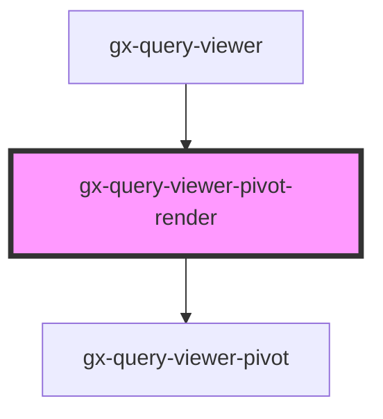

# gx-query-viewer-pivot-controller

<!-- Auto Generated Below -->

## Properties

| Property                          | Attribute                              | Description                                                                                       | Type                                                                                                                                                                                                                                                                                                                                                                                                                                                                                                                         | Default     |
| --------------------------------- | -------------------------------------- | ------------------------------------------------------------------------------------------------- | ---------------------------------------------------------------------------------------------------------------------------------------------------------------------------------------------------------------------------------------------------------------------------------------------------------------------------------------------------------------------------------------------------------------------------------------------------------------------------------------------------------------------------- | ----------- |
| `allowElementsOrderChange`        | `allow-elements-order-change`          | Allowing elements order to change                                                                 | `boolean`                                                                                                                                                                                                                                                                                                                                                                                                                                                                                                                    | `undefined` |
| `allowSelection`                  | `allow-selection`                      | Allow selection                                                                                   | `boolean`                                                                                                                                                                                                                                                                                                                                                                                                                                                                                                                    | `undefined` |
| `attributeValuesForPivotTableXml` | `attribute-values-for-pivot-table-xml` | Response Attribute Values                                                                         | `string`                                                                                                                                                                                                                                                                                                                                                                                                                                                                                                                     | `undefined` |
| `attributeValuesForTableXml`      | `attribute-values-for-table-xml`       | Response Attribute Values for Table                                                               | `string`                                                                                                                                                                                                                                                                                                                                                                                                                                                                                                                     | `undefined` |
| `autoResize`                      | `auto-resize`                          | if true will shrink the table                                                                     | `boolean`                                                                                                                                                                                                                                                                                                                                                                                                                                                                                                                    | `undefined` |
| `calculatePivottableDataXml`      | `calculate-pivottable-data-xml`        | Response Attribute Values                                                                         | `string`                                                                                                                                                                                                                                                                                                                                                                                                                                                                                                                     | `undefined` |
| `controlName` _(required)_        | `control-name`                         | Specifies the name of the control used in the pivot and Table outputs types                       | `string`                                                                                                                                                                                                                                                                                                                                                                                                                                                                                                                     | `undefined` |
| `cssClass`                        | `css-class`                            | A CSS class to set as the `gx-query-viewer-pivot-controller` element class.                       | `string`                                                                                                                                                                                                                                                                                                                                                                                                                                                                                                                     | `undefined` |
| `disableColumnSort`               | `disable-column-sort`                  | Allowing or not Column sort                                                                       | `boolean`                                                                                                                                                                                                                                                                                                                                                                                                                                                                                                                    | `undefined` |
| `pageDataForPivotTable`           | `page-data-for-pivot-table`            | Response Page Data                                                                                | `string`                                                                                                                                                                                                                                                                                                                                                                                                                                                                                                                     | `undefined` |
| `pageDataForTable`                | `page-data-for-table`                  | Response Page Data                                                                                | `string`                                                                                                                                                                                                                                                                                                                                                                                                                                                                                                                     | `undefined` |
| `pageSize`                        | `page-size`                            | Enables you to define the number of rows that will be shown when the Paging property is activated | `number`                                                                                                                                                                                                                                                                                                                                                                                                                                                                                                                     | `undefined` |
| `paging`                          | `paging`                               | This attribute lets you determinate whether there will be paging buttons.                         | `boolean`                                                                                                                                                                                                                                                                                                                                                                                                                                                                                                                    | `undefined` |
| `pivotTableDataSyncXml`           | `pivot-table-data-sync-xml`            | Response Pivot Table Data Sync                                                                    | `string`                                                                                                                                                                                                                                                                                                                                                                                                                                                                                                                     | `undefined` |
| `pivotTitle`                      | `pivot-title`                          | This attribute lets you define a title for the pivot table.                                       | `string`                                                                                                                                                                                                                                                                                                                                                                                                                                                                                                                     | `undefined` |
| `rememberLayout`                  | `remember-layout`                      | For timeline for remembering layout                                                               | `boolean`                                                                                                                                                                                                                                                                                                                                                                                                                                                                                                                    | `undefined` |
| `serviceResponse`                 | --                                     | Specifies the metadata and data that the control will use to render.                              | `{ MetaData: QueryViewerServiceMetaData; metadataXML: string; Properties: QueryViewerBase; objectName: string; useGxQuery: boolean; }`                                                                                                                                                                                                                                                                                                                                                                                       | `undefined` |
| `showDataLabelsIn`                | `show-data-labels-in`                  | It allows to indicate how you want to display the Data elements of the Query object.              | `QueryViewerShowDataLabelsIn.Columns \| QueryViewerShowDataLabelsIn.Rows`                                                                                                                                                                                                                                                                                                                                                                                                                                                    | `undefined` |
| `tableDataSyncXml`                | `table-data-sync-xml`                  | Response Table Data Sync                                                                          | `string`                                                                                                                                                                                                                                                                                                                                                                                                                                                                                                                     | `undefined` |
| `tableType`                       | `table-type`                           | Specifies whether the render output is PivotTable or Table                                        | `QueryViewerOutputType.PivotTable \| QueryViewerOutputType.Table`                                                                                                                                                                                                                                                                                                                                                                                                                                                            | `undefined` |
| `totalForColumns`                 | `total-for-columns`                    | Determines whether to show a total of all values in the pivot table columns.                      | `QueryViewerTotal.No \| QueryViewerTotal.Yes`                                                                                                                                                                                                                                                                                                                                                                                                                                                                                | `undefined` |
| `totalForRows`                    | `total-for-rows`                       | Determines whether to show a total of all values in the pivot table rows.                         | `QueryViewerTotal.No \| QueryViewerTotal.Yes`                                                                                                                                                                                                                                                                                                                                                                                                                                                                                | `undefined` |
| `translations`                    | --                                     | For translate the labels of the outputs                                                           | `{ GXPL_QViewerSinceTheBeginningTrend: string; GXPL_QViewerLastYearTrend: string; GXPL_QViewerLastSemesterTrend: string; GXPL_QViewerLastQuarterTrend: string; GXPL_QViewerLastMonthTrend: string; GXPL_QViewerLastWeekTrend: string; GXPL_QViewerLastDayTrend: string; GXPL_QViewerLastHourTrend: string; GXPL_QViewerLastMinuteTrend: string; GXPL_QViewerLastSecondTrend: string; GXPL_QViewerCardMinimum: string; GXPL_QViewerCardMaximum: string; GXPL_QViewerNoDatetimeAxis: string; GXPL_QViewerNoMapAxis: string; }` | `undefined` |

## Methods

### `firstPage() => Promise<any>`

Method to navigate to the first page.

#### Returns

Type: `Promise<any>`

### `getDataPivot(serverData: string) => Promise<any>`

Returns an XML on a string variable containing all the data for the attributes loaded in the Pivot Table.

#### Returns

Type: `Promise<any>`

### `getFilteredDataPivot(serverData: string) => Promise<any>`

Returns an XML on a string variable containing the data which is being visualized at the moment (the difference with the GetData() method it's seen on the Pivot Table, data can be different because of filters application).

#### Returns

Type: `Promise<any>`

### `lastPage() => Promise<any>`

Method to navigate to the last page.

#### Returns

Type: `Promise<any>`

### `nextPage() => Promise<any>`

Method to navigate to the next page.

#### Returns

Type: `Promise<any>`

### `previousPage() => Promise<any>`

Method to navigate to the previous page.

#### Returns

Type: `Promise<any>`

## Dependencies

### Used by

 - [gx-query-viewer](../../query-viewer)

### Depends on

- [gx-query-viewer-pivot](..)

### Graph

----------------------------------------------

*Built with [StencilJS](https://stenciljs.com/)*
