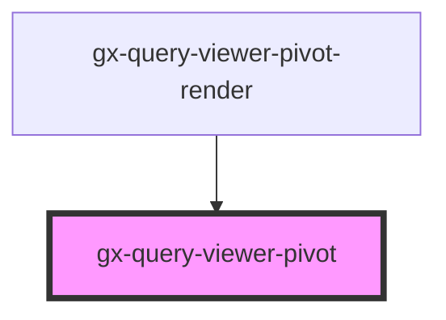

# gx-query-viewer-pivot

<!-- Auto Generated Below -->

## Properties

| Property                          | Attribute                              | Description                                                | Type                                                                                                                                                                                                                                                                                                                                                                                                                                                                                                                                                                                                                                                                                                                                                                                                                                                                                                                                                                                                                                                                                                                                                                                                                       | Default                                                                                                                                                                                                                                                                                                                                                                                                                                                                                                                                                                                                                                                                                                                                                                                                                                                                                                                                                                                                                                                                                                                                                                                                                                                                                                                                                                                                                                                                                                                          |
| --------------------------------- | -------------------------------------- | ---------------------------------------------------------- | -------------------------------------------------------------------------------------------------------------------------------------------------------------------------------------------------------------------------------------------------------------------------------------------------------------------------------------------------------------------------------------------------------------------------------------------------------------------------------------------------------------------------------------------------------------------------------------------------------------------------------------------------------------------------------------------------------------------------------------------------------------------------------------------------------------------------------------------------------------------------------------------------------------------------------------------------------------------------------------------------------------------------------------------------------------------------------------------------------------------------------------------------------------------------------------------------------------------------- | -------------------------------------------------------------------------------------------------------------------------------------------------------------------------------------------------------------------------------------------------------------------------------------------------------------------------------------------------------------------------------------------------------------------------------------------------------------------------------------------------------------------------------------------------------------------------------------------------------------------------------------------------------------------------------------------------------------------------------------------------------------------------------------------------------------------------------------------------------------------------------------------------------------------------------------------------------------------------------------------------------------------------------------------------------------------------------------------------------------------------------------------------------------------------------------------------------------------------------------------------------------------------------------------------------------------------------------------------------------------------------------------------------------------------------------------------------------------------------------------------------------------------------- |
| `QueryViewerTranslations`         | --                                     | QueryViewerTranslations                                    | `{ GXPL_QViewerSinceTheBeginningTrend: string; GXPL_QViewerLastDayTrend: string; GXPL_QViewerLastHourTrend: string; GXPL_QViewerJSAllOption: string; GXPL_QViewerJSAscending: string; GXPL_QViewerJSDescending: string; GXPL_QViewerJSSubtotals: string; GXPL_QViewerJSRestoreDefaultView: string; GXPL_QViewerJSPivotDimensionToColumn: string; GXPL_QViewerJSPivotDimensionToRow: string; GXPL_QViewerJSMoveToFilterBar: string; GXPL_QViewerJSAll: string; GXPL_QViewerJSNone: string; GXPL_QViewerJSReverse: string; GXPL_QViewerSearch: string; GXPL_QViewerInfoUser: string; GXPL_QViewerJSDropFiltersHere: string; GXPL_QViewerPopupTitle: string; GXPL_QViewerJSVisibleColumns: string; GXPL_QViewerContextMenuExportXml: string; GXPL_QViewerContextMenuExportHtml: string; GXPL_QViewerContextMenuExportPdf: string; GXPL_QViewerContextMenuExportXls2003: string; GXPL_QViewerContextMenuExportXlsx: string; GXPL_QViewerJSMeasures: string; GXPL_QViewerJSValue: string; GXPL_QViewerJSTotal: string; GXPL_QViewerJSTotalFor: string; GXPL_QViewerJSPerPage: string; GXPL_QViewerJSPage: string; GXPL_QViewerJSOf: string; GXPL_QViewerJSMoveColumnToLeft: string; GXPL_QViewerJSMoveColumnToRight: string; }` | `{     GXPL_QViewerSinceTheBeginningTrend: "Trend Since The Beginning",     GXPL_QViewerLastDayTrend: "Trend Last Day",     GXPL_QViewerLastHourTrend: "Trend Last hour",     GXPL_QViewerJSAllOption: "Todos",     GXPL_QViewerJSAscending: "Ascending",     GXPL_QViewerJSDescending: "Descendiente",     GXPL_QViewerJSSubtotals: "Subtotal",     GXPL_QViewerJSRestoreDefaultView: "Restore",     GXPL_QViewerJSPivotDimensionToColumn: "To COlumns",     GXPL_QViewerJSPivotDimensionToRow: "To Dimensions",     GXPL_QViewerJSMoveToFilterBar: "To Filters",     GXPL_QViewerJSAll: "ALL",     GXPL_QViewerJSNone: "NONE",     GXPL_QViewerJSReverse: "Revert",     GXPL_QViewerSearch: "Search",     GXPL_QViewerInfoUser: "User Info",     GXPL_QViewerJSDropFiltersHere: "Drop her filters",     GXPL_QViewerPopupTitle: "Title p",     GXPL_QViewerJSVisibleColumns: "Visible columns",     GXPL_QViewerContextMenuExportXml: "Export to XML",     GXPL_QViewerContextMenuExportHtml: "To Html",     GXPL_QViewerContextMenuExportPdf: "To PDF",     GXPL_QViewerContextMenuExportXls2003: "To xls",     GXPL_QViewerContextMenuExportXlsx: "To Xlsx",     GXPL_QViewerJSMeasures: "Measures",     GXPL_QViewerJSValue: "Value",     GXPL_QViewerJSTotal: "Grand Total",     GXPL_QViewerJSTotalFor: "Total for",     GXPL_QViewerJSPerPage: "Roes:",     GXPL_QViewerJSPage: "Pags:",     GXPL_QViewerJSOf: "of",     GXPL_QViewerJSMoveColumnToLeft: "to left",     GXPL_QViewerJSMoveColumnToRight: "to right"   }` |
| `attributeValuesForPivotTableXml` | `attribute-values-for-pivot-table-xml` | Response Attribute Values                                  | `string`                                                                                                                                                                                                                                                                                                                                                                                                                                                                                                                                                                                                                                                                                                                                                                                                                                                                                                                                                                                                                                                                                                                                                                                                                   | `undefined`                                                                                                                                                                                                                                                                                                                                                                                                                                                                                                                                                                                                                                                                                                                                                                                                                                                                                                                                                                                                                                                                                                                                                                                                                                                                                                                                                                                                                                                                                                                      |
| `attributeValuesForTableXml`      | `attribute-values-for-table-xml`       | Response Attribute Values                                  | `string`                                                                                                                                                                                                                                                                                                                                                                                                                                                                                                                                                                                                                                                                                                                                                                                                                                                                                                                                                                                                                                                                                                                                                                                                                   | `undefined`                                                                                                                                                                                                                                                                                                                                                                                                                                                                                                                                                                                                                                                                                                                                                                                                                                                                                                                                                                                                                                                                                                                                                                                                                                                                                                                                                                                                                                                                                                                      |
| `calculatePivottableDataXml`      | `calculate-pivottable-data-xml`        | Response calculation PivotTable Data                       | `string`                                                                                                                                                                                                                                                                                                                                                                                                                                                                                                                                                                                                                                                                                                                                                                                                                                                                                                                                                                                                                                                                                                                                                                                                                   | `undefined`                                                                                                                                                                                                                                                                                                                                                                                                                                                                                                                                                                                                                                                                                                                                                                                                                                                                                                                                                                                                                                                                                                                                                                                                                                                                                                                                                                                                                                                                                                                      |
| `data`                            | `data`                                 | data                                                       | `string`                                                                                                                                                                                                                                                                                                                                                                                                                                                                                                                                                                                                                                                                                                                                                                                                                                                                                                                                                                                                                                                                                                                                                                                                                   | `undefined`                                                                                                                                                                                                                                                                                                                                                                                                                                                                                                                                                                                                                                                                                                                                                                                                                                                                                                                                                                                                                                                                                                                                                                                                                                                                                                                                                                                                                                                                                                                      |
| `pageDataForPivotTable`           | `page-data-for-pivot-table`            | Response Page Data                                         | `string`                                                                                                                                                                                                                                                                                                                                                                                                                                                                                                                                                                                                                                                                                                                                                                                                                                                                                                                                                                                                                                                                                                                                                                                                                   | `undefined`                                                                                                                                                                                                                                                                                                                                                                                                                                                                                                                                                                                                                                                                                                                                                                                                                                                                                                                                                                                                                                                                                                                                                                                                                                                                                                                                                                                                                                                                                                                      |
| `pageDataForTable`                | `page-data-for-table`                  | Response Page Data                                         | `string`                                                                                                                                                                                                                                                                                                                                                                                                                                                                                                                                                                                                                                                                                                                                                                                                                                                                                                                                                                                                                                                                                                                                                                                                                   | `undefined`                                                                                                                                                                                                                                                                                                                                                                                                                                                                                                                                                                                                                                                                                                                                                                                                                                                                                                                                                                                                                                                                                                                                                                                                                                                                                                                                                                                                                                                                                                                      |
| `pivotCollection`                 | --                                     | pivotCollection                                            | `{ collection: { [key: string]: QueryViewerPivotCollectionProperties; }; fadeTimeouts: any; }`                                                                                                                                                                                                                                                                                                                                                                                                                                                                                                                                                                                                                                                                                                                                                                                                                                                                                                                                                                                                                                                                                                                             | `undefined`                                                                                                                                                                                                                                                                                                                                                                                                                                                                                                                                                                                                                                                                                                                                                                                                                                                                                                                                                                                                                                                                                                                                                                                                                                                                                                                                                                                                                                                                                                                      |
| `pivotParameters`                 | --                                     | pivotParameters                                            | `{ AllowSelection: boolean; AutoResize: boolean; ControlName: string; DisableColumnSort: boolean; ObjectName: string; PageSize: number; RealType: QueryViewerOutputType; RememberLayout: boolean; SelectLine: boolean; ServerPaging?: boolean; ServerPagingCacheSize?: number; ServerPagingPivot?: boolean; ShowDataLabelsIn: QueryViewerShowDataLabelsIn; Title: string; TotalForColumns: QueryViewerTotal; TotalForRows: QueryViewerTotal; UcId: string; UseRecordsetCache: boolean; metadata: string; }`                                                                                                                                                                                                                                                                                                                                                                                                                                                                                                                                                                                                                                                                                                                | `undefined`                                                                                                                                                                                                                                                                                                                                                                                                                                                                                                                                                                                                                                                                                                                                                                                                                                                                                                                                                                                                                                                                                                                                                                                                                                                                                                                                                                                                                                                                                                                      |
| `pivotTableDataSyncXml`           | `pivot-table-data-sync-xml`            | Response PivotTable Data Sync                              | `string`                                                                                                                                                                                                                                                                                                                                                                                                                                                                                                                                                                                                                                                                                                                                                                                                                                                                                                                                                                                                                                                                                                                                                                                                                   | `undefined`                                                                                                                                                                                                                                                                                                                                                                                                                                                                                                                                                                                                                                                                                                                                                                                                                                                                                                                                                                                                                                                                                                                                                                                                                                                                                                                                                                                                                                                                                                                      |
| `tableDataSyncXml`                | `table-data-sync-xml`                  | Response Table Data Sync                                   | `string`                                                                                                                                                                                                                                                                                                                                                                                                                                                                                                                                                                                                                                                                                                                                                                                                                                                                                                                                                                                                                                                                                                                                                                                                                   | `undefined`                                                                                                                                                                                                                                                                                                                                                                                                                                                                                                                                                                                                                                                                                                                                                                                                                                                                                                                                                                                                                                                                                                                                                                                                                                                                                                                                                                                                                                                                                                                      |
| `tableType`                       | `table-type`                           | Specifies whether the render output is PivotTable or Table | `QueryViewerOutputType.PivotTable \| QueryViewerOutputType.Table`                                                                                                                                                                                                                                                                                                                                                                                                                                                                                                                                                                                                                                                                                                                                                                                                                                                                                                                                                                                                                                                                                                                                                          | `undefined`                                                                                                                                                                                                                                                                                                                                                                                                                                                                                                                                                                                                                                                                                                                                                                                                                                                                                                                                                                                                                                                                                                                                                                                                                                                                                                                                                                                                                                                                                                                      |

## Methods

### `firstPage() => Promise<any>`

Method to navigate to the first page.

#### Returns

Type: `Promise<any>`

### `getDataXML(serverData: any) => Promise<any>`

Returns an XML on a string variable containing all the data for the attributes loaded in the Pivot Table.

#### Returns

Type: `Promise<any>`

### `getFilteredDataPivot() => Promise<any>`

Returns an XML on a string variable containing the data which is being visualized at the moment (the difference with the GetData() method it's seen on the Pivot Table, data can be different because of filters application).

#### Returns

Type: `Promise<any>`

### `lastPage() => Promise<any>`

Method to navigate to the last page.

#### Returns

Type: `Promise<any>`

### `nextPage() => Promise<any>`

Method to navigate to the next page.

#### Returns

Type: `Promise<any>`

### `previousPage() => Promise<any>`

Method to navigate to the previous page.

#### Returns

Type: `Promise<any>`

## Dependencies

### Used by

 - [gx-query-viewer-pivot-render](controller)

### Graph

----------------------------------------------

*Built with [StencilJS](https://stenciljs.com/)*
