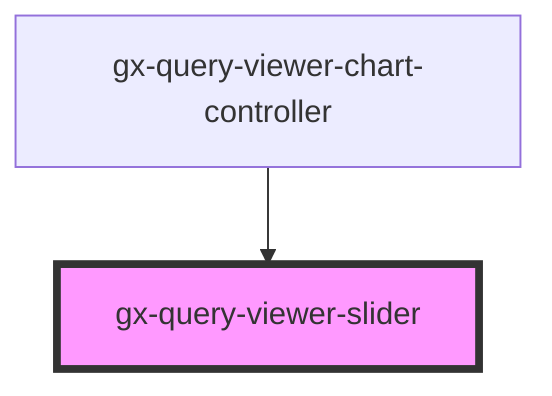

# gx-query-viewer-slider

<!-- Auto Generated Below -->

## Properties

| Property           | Attribute            | Description                                                      | Type     | Default             |
| ------------------ | -------------------- | ---------------------------------------------------------------- | -------- | ------------------- |
| `endSliderValue`   | `end-slider-value`   | This property determines the value of the end position slider.   | `number` | `DEFAULT_MAX_VALUE` |
| `startSliderValue` | `start-slider-value` | This property determines the value of the start position slider. | `number` | `DEFAULT_MIN_VALUE` |
| `step`             | `step`               | This attribute lets you define the steps for each slider.        | `number` | `0.1`               |

## Events

| Event    | Description                                                     | Type                                           |
| -------- | --------------------------------------------------------------- | ---------------------------------------------- |
| `change` | Fired when a new range of the control is committed by the user. | `CustomEvent<{ start: number; end: number; }>` |

## Shadow Parts

| Part                 | Description |
| -------------------- | ----------- |
| `"end"`              |             |
| `"end-thumb"`        |             |
| `"invisible-slider"` |             |
| `"mask"`             |             |
| `"start"`            |             |
| `"start-thumb"`      |             |
| `"thumb"`            |             |

## Dependencies

### Used by

 - [gx-query-viewer-chart-controller](../query-viewer-chart/controller)

### Graph

----------------------------------------------

*Built with [StencilJS](https://stenciljs.com/)*
