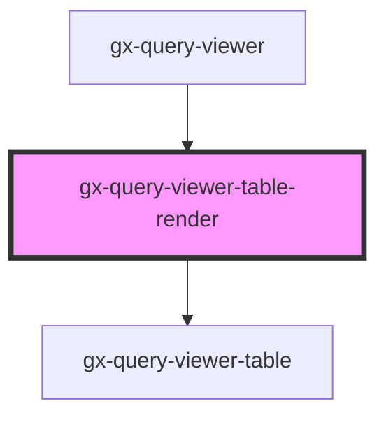

# gx-query-viewer-pivot-controller

<!-- Auto Generated Below -->

## Properties

| Property                     | Attribute                        | Description                                                                                       | Type                                                                                                                                                                                                                                                                                                                                                                                                                                                                                                                         | Default     |
| ---------------------------- | -------------------------------- | ------------------------------------------------------------------------------------------------- | ---------------------------------------------------------------------------------------------------------------------------------------------------------------------------------------------------------------------------------------------------------------------------------------------------------------------------------------------------------------------------------------------------------------------------------------------------------------------------------------------------------------------------- | ----------- |
| `allowElementsOrderChange`   | `allow-elements-order-change`    | Allowing elements order to change                                                                 | `boolean`                                                                                                                                                                                                                                                                                                                                                                                                                                                                                                                    | `undefined` |
| `allowSelection`             | `allow-selection`                | Allow selection                                                                                   | `boolean`                                                                                                                                                                                                                                                                                                                                                                                                                                                                                                                    | `undefined` |
| `attributeValuesForTableXml` | `attribute-values-for-table-xml` | Response Attribute Values for Pivot Table                                                         | `string`                                                                                                                                                                                                                                                                                                                                                                                                                                                                                                                     | `undefined` |
| `cssClass`                   | `css-class`                      | A CSS class to set as the `gx-query-viewer-pivot-controller` element class.                       | `string`                                                                                                                                                                                                                                                                                                                                                                                                                                                                                                                     | `undefined` |
| `disableColumnSort`          | `disable-column-sort`            | Allowing or not Column sort                                                                       | `boolean`                                                                                                                                                                                                                                                                                                                                                                                                                                                                                                                    | `undefined` |
| `getTableDataSyncXml`        | `get-table-data-sync-xml`        | Response Table Data Sync                                                                          | `string`                                                                                                                                                                                                                                                                                                                                                                                                                                                                                                                     | `undefined` |
| `pageDataForTable`           | `page-data-for-table`            | Response Page Data                                                                                | `string`                                                                                                                                                                                                                                                                                                                                                                                                                                                                                                                     | `undefined` |
| `pageSize`                   | `page-size`                      | Enables you to define the number of rows that will be shown when the Paging property is activated | `number`                                                                                                                                                                                                                                                                                                                                                                                                                                                                                                                     | `undefined` |
| `paging`                     | `paging`                         | This attribute lets you determinate whether there will be paging buttons.                         | `boolean`                                                                                                                                                                                                                                                                                                                                                                                                                                                                                                                    | `undefined` |
| `rememberLayout`             | `remember-layout`                | For timeline for remembering layout                                                               | `boolean`                                                                                                                                                                                                                                                                                                                                                                                                                                                                                                                    | `undefined` |
| `serviceResponse`            | --                               | Specifies the metadata and data that the control will use to render.                              | `{ MetaData: QueryViewerServiceMetaData; metadataXML: string; Properties: QueryViewerBase; objectName: string; useGxQuery: boolean; }`                                                                                                                                                                                                                                                                                                                                                                                       | `undefined` |
| `showDataLabelsIn`           | `show-data-labels-in`            | It allows to indicate how you want to display the Data elements of the Query object.              | `QueryViewerShowDataLabelsIn.Columns \| QueryViewerShowDataLabelsIn.Rows`                                                                                                                                                                                                                                                                                                                                                                                                                                                    | `undefined` |
| `tableTitle`                 | `table-title`                    | This attribute lets you define a title for the table.                                             | `string`                                                                                                                                                                                                                                                                                                                                                                                                                                                                                                                     | `undefined` |
| `totalForColumns`            | `total-for-columns`              | Determines whether to show a total of all values in the pivot table columns.                      | `QueryViewerTotal.No \| QueryViewerTotal.Yes`                                                                                                                                                                                                                                                                                                                                                                                                                                                                                | `undefined` |
| `totalForRows`               | `total-for-rows`                 | Determines whether to show a total of all values in the pivot table rows.                         | `QueryViewerTotal.No \| QueryViewerTotal.Yes`                                                                                                                                                                                                                                                                                                                                                                                                                                                                                | `undefined` |
| `translations`               | --                               | For translate the labels of the outputs                                                           | `{ GXPL_QViewerSinceTheBeginningTrend: string; GXPL_QViewerLastYearTrend: string; GXPL_QViewerLastSemesterTrend: string; GXPL_QViewerLastQuarterTrend: string; GXPL_QViewerLastMonthTrend: string; GXPL_QViewerLastWeekTrend: string; GXPL_QViewerLastDayTrend: string; GXPL_QViewerLastHourTrend: string; GXPL_QViewerLastMinuteTrend: string; GXPL_QViewerLastSecondTrend: string; GXPL_QViewerCardMinimum: string; GXPL_QViewerCardMaximum: string; GXPL_QViewerNoDatetimeAxis: string; GXPL_QViewerNoMapAxis: string; }` | `undefined` |

## Dependencies

### Used by

 - [gx-query-viewer](../../query-viewer)

### Depends on

- [gx-query-viewer-table](..)

### Graph

----------------------------------------------

*Built with [StencilJS](https://stenciljs.com/)*
