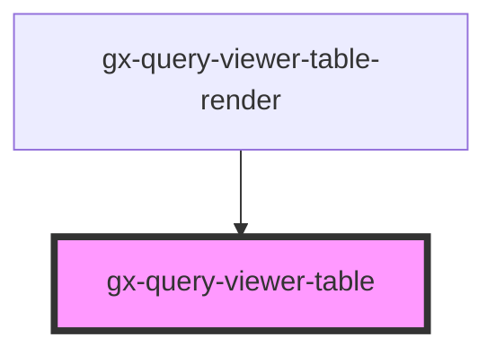

# gx-query-viewer-table

<!-- Auto Generated Below -->

## Properties

| Property                     | Attribute                        | Description               | Type                                                                                                                                                                                                                                                                                                                                                                                                                                                                                                                                                                                                                                                                                                                                                                                                                                                                                                                                                                                                                                                                                                                                                                                                                       | Default                                                                                                                                                                                                                                                                                                                                                                                                                                                                                                                                                                                                                                                                                                                                                                                                                                                                                                                                                                                                                                                                                                                                                                                                                                                                                                                                                                                                                                                                                                                                                                                                                                                                                                                                                                                                                                                                                                                                                                    |
| ---------------------------- | -------------------------------- | ------------------------- | -------------------------------------------------------------------------------------------------------------------------------------------------------------------------------------------------------------------------------------------------------------------------------------------------------------------------------------------------------------------------------------------------------------------------------------------------------------------------------------------------------------------------------------------------------------------------------------------------------------------------------------------------------------------------------------------------------------------------------------------------------------------------------------------------------------------------------------------------------------------------------------------------------------------------------------------------------------------------------------------------------------------------------------------------------------------------------------------------------------------------------------------------------------------------------------------------------------------------- | -------------------------------------------------------------------------------------------------------------------------------------------------------------------------------------------------------------------------------------------------------------------------------------------------------------------------------------------------------------------------------------------------------------------------------------------------------------------------------------------------------------------------------------------------------------------------------------------------------------------------------------------------------------------------------------------------------------------------------------------------------------------------------------------------------------------------------------------------------------------------------------------------------------------------------------------------------------------------------------------------------------------------------------------------------------------------------------------------------------------------------------------------------------------------------------------------------------------------------------------------------------------------------------------------------------------------------------------------------------------------------------------------------------------------------------------------------------------------------------------------------------------------------------------------------------------------------------------------------------------------------------------------------------------------------------------------------------------------------------------------------------------------------------------------------------------------------------------------------------------------------------------------------------------------------------------------------------------------- |
| `QueryViewerTranslations`    | --                               | QueryViewerTranslations   | `{ GXPL_QViewerSinceTheBeginningTrend: string; GXPL_QViewerLastDayTrend: string; GXPL_QViewerLastHourTrend: string; GXPL_QViewerJSAllOption: string; GXPL_QViewerJSAscending: string; GXPL_QViewerJSDescending: string; GXPL_QViewerJSSubtotals: string; GXPL_QViewerJSRestoreDefaultView: string; GXPL_QViewerJSPivotDimensionToColumn: string; GXPL_QViewerJSPivotDimensionToRow: string; GXPL_QViewerJSMoveToFilterBar: string; GXPL_QViewerJSAll: string; GXPL_QViewerJSNone: string; GXPL_QViewerJSReverse: string; GXPL_QViewerSearch: string; GXPL_QViewerInfoUser: string; GXPL_QViewerJSDropFiltersHere: string; GXPL_QViewerPopupTitle: string; GXPL_QViewerJSVisibleColumns: string; GXPL_QViewerContextMenuExportXml: string; GXPL_QViewerContextMenuExportHtml: string; GXPL_QViewerContextMenuExportPdf: string; GXPL_QViewerContextMenuExportXls2003: string; GXPL_QViewerContextMenuExportXlsx: string; GXPL_QViewerJSMeasures: string; GXPL_QViewerJSValue: string; GXPL_QViewerJSTotal: string; GXPL_QViewerJSTotalFor: string; GXPL_QViewerJSPerPage: string; GXPL_QViewerJSPage: string; GXPL_QViewerJSOf: string; GXPL_QViewerJSMoveColumnToLeft: string; GXPL_QViewerJSMoveColumnToRight: string; }` | `{     GXPL_QViewerSinceTheBeginningTrend: "Trend Since The Beginning",     GXPL_QViewerLastDayTrend: "Trend Last Day",     GXPL_QViewerLastHourTrend: "Trend Last hour",     GXPL_QViewerJSAllOption: "Todos",     GXPL_QViewerJSAscending: "Ascending",     GXPL_QViewerJSDescending: "Descendiente",     GXPL_QViewerJSSubtotals: "Subtotal",     GXPL_QViewerJSRestoreDefaultView: "Restore",     GXPL_QViewerJSPivotDimensionToColumn: "To COlumns",     GXPL_QViewerJSPivotDimensionToRow: "To Dimensions",     GXPL_QViewerJSMoveToFilterBar: "To Filters",     GXPL_QViewerJSAll: "ALL",     GXPL_QViewerJSNone: "NONE",     GXPL_QViewerJSReverse: "Revert",     GXPL_QViewerSearch: "Search",     GXPL_QViewerInfoUser: "User Info",     GXPL_QViewerJSDropFiltersHere: "Drop her filters",     GXPL_QViewerPopupTitle: "Title p",     GXPL_QViewerJSVisibleColumns: "Visible columns",     GXPL_QViewerContextMenuExportXml: "Export to XML",     GXPL_QViewerContextMenuExportHtml: "To Html",     GXPL_QViewerContextMenuExportPdf: "To PDF",     GXPL_QViewerContextMenuExportXls2003: "To xls",     GXPL_QViewerContextMenuExportXlsx: "To Xlsx",     GXPL_QViewerJSMeasures: "Measures",     GXPL_QViewerJSValue: "Value",     GXPL_QViewerJSTotal: "Grand Total",     GXPL_QViewerJSTotalFor: "Total for",     GXPL_QViewerJSPerPage: "Roes:",     GXPL_QViewerJSPage: "Pags:",     GXPL_QViewerJSOf: "of",     GXPL_QViewerJSMoveColumnToLeft: "to left",     GXPL_QViewerJSMoveColumnToRight: "to right"   }`                                                                                                                                                                                                                                                                                                                                                                                                                                           |
| `attributeValuesForTableXml` | `attribute-values-for-table-xml` | Response Attribute Values | `string`                                                                                                                                                                                                                                                                                                                                                                                                                                                                                                                                                                                                                                                                                                                                                                                                                                                                                                                                                                                                                                                                                                                                                                                                                   | `undefined`                                                                                                                                                                                                                                                                                                                                                                                                                                                                                                                                                                                                                                                                                                                                                                                                                                                                                                                                                                                                                                                                                                                                                                                                                                                                                                                                                                                                                                                                                                                                                                                                                                                                                                                                                                                                                                                                                                                                                                |
| `data`                       | `data`                           | data                      | `string`                                                                                                                                                                                                                                                                                                                                                                                                                                                                                                                                                                                                                                                                                                                                                                                                                                                                                                                                                                                                                                                                                                                                                                                                                   | ``<?xml version = "1.0" encoding = "UTF-8"?>   <Recordset RecordCount="10" PageCount="1">     <Page PageNumber="1">       <Columns>         <Header DataField="F1">         </Header>       </Columns>       <Rows>         <Row>           <Header>             <F2>2023-02-12</F2>           </Header>           <Cells>             <Cell>120</Cell>           </Cells>         </Row>         <Row>           <Header>             <F2>2023-05-15</F2>           </Header>           <Cells>             <Cell>100</Cell>           </Cells>         </Row>         <Row>           <Header>             <F2>2023-05-16</F2>           </Header>           <Cells>             <Cell>200</Cell>           </Cells>         </Row>         <Row>           <Header>             <F2>2023-05-17</F2>           </Header>           <Cells>             <Cell>150</Cell>           </Cells>         </Row>         <Row>           <Header>             <F2>2023-05-18</F2>           </Header>           <Cells>             <Cell>250</Cell>           </Cells>         </Row>         <Row>           <Header>             <F2>2023-05-19</F2>           </Header>           <Cells>             <Cell>120</Cell>           </Cells>         </Row>         <Row>           <Header>             <F2>2023-05-20</F2>           </Header>           <Cells>             <Cell>400</Cell>           </Cells>         </Row>         <Row>           <Header>             <F2>2023-06-20</F2>           </Header>           <Cells>             <Cell>80</Cell>           </Cells>         </Row>         <Row>           <Header>             <F2>2023-09-10</F2>           </Header>           <Cells>             <Cell>233</Cell>           </Cells>         </Row>         <Row>           <Header Subtotal="true">           </Header>           <Cells>             <Cell>1653</Cell>           </Cells>         </Row>       </Rows>     </Page>   </Recordset>`` |
| `pageDataForTable`           | `page-data-for-table`            | Response Page Data        | `string`                                                                                                                                                                                                                                                                                                                                                                                                                                                                                                                                                                                                                                                                                                                                                                                                                                                                                                                                                                                                                                                                                                                                                                                                                   | `undefined`                                                                                                                                                                                                                                                                                                                                                                                                                                                                                                                                                                                                                                                                                                                                                                                                                                                                                                                                                                                                                                                                                                                                                                                                                                                                                                                                                                                                                                                                                                                                                                                                                                                                                                                                                                                                                                                                                                                                                                |
| `pivotCollection`            | --                               | pivotCollection           | `{ collection: { [key: string]: QueryViewerPivotCollectionProperties; }; fadeTimeouts: any; }`                                                                                                                                                                                                                                                                                                                                                                                                                                                                                                                                                                                                                                                                                                                                                                                                                                                                                                                                                                                                                                                                                                                             | `undefined`                                                                                                                                                                                                                                                                                                                                                                                                                                                                                                                                                                                                                                                                                                                                                                                                                                                                                                                                                                                                                                                                                                                                                                                                                                                                                                                                                                                                                                                                                                                                                                                                                                                                                                                                                                                                                                                                                                                                                                |
| `pivotParameters`            | --                               | pivotParameters           | `{ AllowSelection: boolean; AutoResize: boolean; ControlName: string; DisableColumnSort: boolean; ObjectName: string; PageSize: number; RealType: QueryViewerOutputType; RememberLayout: boolean; SelectLine: boolean; ServerPaging?: boolean; ServerPagingCacheSize?: number; ServerPagingPivot?: boolean; ShowDataLabelsIn: QueryViewerShowDataLabelsIn; Title: string; TotalForColumns: QueryViewerTotal; TotalForRows: QueryViewerTotal; UcId: string; UseRecordsetCache: boolean; data?: string; metadata: string; }`                                                                                                                                                                                                                                                                                                                                                                                                                                                                                                                                                                                                                                                                                                 | `undefined`                                                                                                                                                                                                                                                                                                                                                                                                                                                                                                                                                                                                                                                                                                                                                                                                                                                                                                                                                                                                                                                                                                                                                                                                                                                                                                                                                                                                                                                                                                                                                                                                                                                                                                                                                                                                                                                                                                                                                                |

## Dependencies

### Used by

 - [gx-query-viewer-table-render](controller)

### Graph

----------------------------------------------

*Built with [StencilJS](https://stenciljs.com/)*
