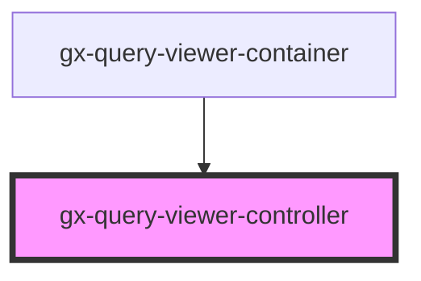

# gx-query-viewer-controller

<!-- Auto Generated Below -->

## Properties

| Property                   | Attribute                     | Description                                                                                                                                                                                                                                                                                          | Type                                                                                                                                                                                         | Default     |
| -------------------------- | ----------------------------- | ---------------------------------------------------------------------------------------------------------------------------------------------------------------------------------------------------------------------------------------------------------------------------------------------------- | -------------------------------------------------------------------------------------------------------------------------------------------------------------------------------------------- | ----------- |
| `allowElementsOrderChange` | `allow-elements-order-change` |                                                                                                                                                                                                                                                                                                      | `boolean`                                                                                                                                                                                    | `false`     |
| `applicationNamespace`     | `application-namespace`       | Determines the application namespace where the program is generated and compiled.                                                                                                                                                                                                                    | `string`                                                                                                                                                                                     | `undefined` |
| `baseUrl`                  | `base-url`                    | Base URL of the server                                                                                                                                                                                                                                                                               | `string`                                                                                                                                                                                     | `undefined` |
| `chartType`                | `chart-type`                  | When `type == Chart`, specifies the chart type: Bar, Pie, Timeline, etc...                                                                                                                                                                                                                           | `QueryViewerChartType`                                                                                                                                                                       | `undefined` |
| `environment`              | `environment`                 | Environment of the project: java or net                                                                                                                                                                                                                                                              | `"java" \| "net"`                                                                                                                                                                            | `undefined` |
| `includeSparkline`         | `include-sparkline`           | Include spark line                                                                                                                                                                                                                                                                                   | `boolean`                                                                                                                                                                                    | `false`     |
| `includeTrend`             | `include-trend`               | If true includes trend on the graph                                                                                                                                                                                                                                                                  | `boolean`                                                                                                                                                                                    | `false`     |
| `metadataName`             | `metadata-name`               | This is the name of the metadata (all the queries belong to a certain metadata) the connector will use when useGxquery = true. In this case the connector must be told the query to execute, either by name (via the objectName property) or giving a full serialized query (via the query property) | `string`                                                                                                                                                                                     | `undefined` |
| `objectName`               | `object-name`                 | Name of the Query or Data provider assigned                                                                                                                                                                                                                                                          | `string`                                                                                                                                                                                     | `undefined` |
| `orientation`              | `orientation`                 | Specified the orientation when have more than one card                                                                                                                                                                                                                                               | `QueryViewerOrientation.Horizontal \| QueryViewerOrientation.Vertical`                                                                                                                       | `undefined` |
| `rememberLayout`           | `remember-layout`             | For timeline for remembering layout                                                                                                                                                                                                                                                                  | `boolean`                                                                                                                                                                                    | `true`      |
| `returnSampleData`         | `return-sample-data`          |                                                                                                                                                                                                                                                                                                      | `boolean`                                                                                                                                                                                    | `false`     |
| `serializedObject`         | `serialized-object`           | Use this property to pass a query obtained from GXquery, when useGxquery = true (ignored if objectName is specified, because this property has a greater precedence)                                                                                                                                 | `string`                                                                                                                                                                                     | `undefined` |
| `translationType`          | `translation-type`            |                                                                                                                                                                                                                                                                                                      | `string`                                                                                                                                                                                     | `"None"`    |
| `type`                     | `type`                        | Type of the QueryViewer: Table, PivotTable, Chart, Card                                                                                                                                                                                                                                              | `QueryViewerOutputType.Card \| QueryViewerOutputType.Chart \| QueryViewerOutputType.Default \| QueryViewerOutputType.Map \| QueryViewerOutputType.PivotTable \| QueryViewerOutputType.Table` | `undefined` |
| `useGxquery`               | `use-gxquery`                 | True to tell the controller to connect use GXquery as a queries repository                                                                                                                                                                                                                           | `boolean`                                                                                                                                                                                    | `undefined` |

## Events

| Event                        | Description                                 | Type                                                                                                                |
| ---------------------------- | ------------------------------------------- | ------------------------------------------------------------------------------------------------------------------- |
| `queryViewerErrorResponse`   | Fired when there is an error fetching data  | `CustomEvent<string>`                                                                                               |
| `queryViewerServiceResponse` | Fired when new metadata and data is fetched | `CustomEvent<{ MetaData: QueryViewerServiceMetaData; Data: QueryViewerServiceData; Properties: QueryViewerBase; }>` |

## Dependencies

### Used by

 - [gx-query-viewer-container](../../gx-query/query-viewer-container)

### Graph

----------------------------------------------

*Built with [StencilJS](https://stenciljs.com/)*
