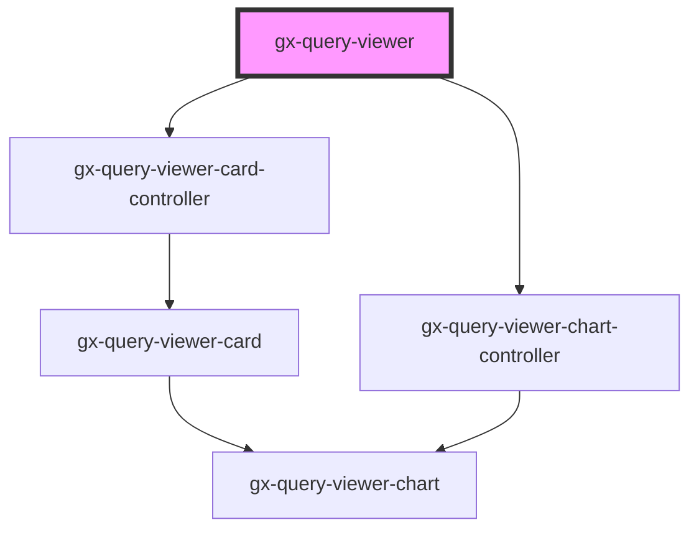

# gx-query-viewer

<!-- Auto Generated Below -->

## Properties

| Property                   | Attribute                     | Description                                                                                            | Type                                                                                                                                                                                                                                                                                                                                                                                                                                                                                                                         | Default                                    |
| -------------------------- | ----------------------------- | ------------------------------------------------------------------------------------------------------ | ---------------------------------------------------------------------------------------------------------------------------------------------------------------------------------------------------------------------------------------------------------------------------------------------------------------------------------------------------------------------------------------------------------------------------------------------------------------------------------------------------------------------------- | ------------------------------------------ |
| `allowElementsOrderChange` | `allow-elements-order-change` | Allowing elements order to change                                                                      | `boolean`                                                                                                                                                                                                                                                                                                                                                                                                                                                                                                                    | `undefined`                                |
| `allowSelection`           | `allow-selection`             | Allow selection                                                                                        | `boolean`                                                                                                                                                                                                                                                                                                                                                                                                                                                                                                                    | `undefined`                                |
| `autoRefreshGroup`         | `auto-refresh-group`          | Auto refresh group                                                                                     | `string`                                                                                                                                                                                                                                                                                                                                                                                                                                                                                                                     | `undefined`                                |
| `autoResize`               | `auto-resize`                 | If type== PivotTable or Table, if true will shrink the table                                           | `boolean`                                                                                                                                                                                                                                                                                                                                                                                                                                                                                                                    | `undefined`                                |
| `autoResizeType`           | `auto-resize-type`            | If autoResize, in here select the type, Width, height, or both                                         | `"Both" \| "Horizontal" \| "Vertical"`                                                                                                                                                                                                                                                                                                                                                                                                                                                                                       | `undefined`                                |
| `chartType`                | `chart-type`                  | If type == Chart, this is the chart type: Bar, Pie, Timeline, etc...                                   | `QueryViewerChartType`                                                                                                                                                                                                                                                                                                                                                                                                                                                                                                       | `undefined`                                |
| `cssClass`                 | `css-class`                   | A CSS class to set as the `gx-query-viewer` element class.                                             | `string`                                                                                                                                                                                                                                                                                                                                                                                                                                                                                                                     | `undefined`                                |
| `dataVersionId`            | `data-version-id`             | Version of data                                                                                        | `number`                                                                                                                                                                                                                                                                                                                                                                                                                                                                                                                     | `undefined`                                |
| `disableColumnSort`        | `disable-column-sort`         | Allowing or not Comlumn sort                                                                           | `boolean`                                                                                                                                                                                                                                                                                                                                                                                                                                                                                                                    | `undefined`                                |
| `exportToHTML`             | `export-to-h-t-m-l`           | If type== PivotTable or Table allow to export to HTML                                                  | `boolean`                                                                                                                                                                                                                                                                                                                                                                                                                                                                                                                    | `undefined`                                |
| `exportToPDF`              | `export-to-p-d-f`             | If type== PivotTable or Table allow to export to PDF                                                   | `boolean`                                                                                                                                                                                                                                                                                                                                                                                                                                                                                                                    | `undefined`                                |
| `exportToXLS`              | `export-to-x-l-s`             | If type== PivotTable or Table allow to export to XLS                                                   | `boolean`                                                                                                                                                                                                                                                                                                                                                                                                                                                                                                                    | `undefined`                                |
| `exportToXLSX`             | `export-to-x-l-s-x`           | If type== PivotTable or Table allow to export to XLSX                                                  | `boolean`                                                                                                                                                                                                                                                                                                                                                                                                                                                                                                                    | `undefined`                                |
| `exportToXML`              | `export-to-x-m-l`             | If type== PivotTable or Table allow to export to XML                                                   | `boolean`                                                                                                                                                                                                                                                                                                                                                                                                                                                                                                                    | `undefined`                                |
| `includeMaxMin`            | `include-max-min`             | Specifies whether to include the maximum and minimum values in the series.                             | `boolean`                                                                                                                                                                                                                                                                                                                                                                                                                                                                                                                    | `undefined`                                |
| `includeSparkline`         | `include-sparkline`           | Specifies whether to include a sparkline chart for the values or not.                                  | `boolean`                                                                                                                                                                                                                                                                                                                                                                                                                                                                                                                    | `undefined`                                |
| `includeTrend`             | `include-trend`               | Specifies whether to include a trend mark for the values or not.                                       | `boolean`                                                                                                                                                                                                                                                                                                                                                                                                                                                                                                                    | `undefined`                                |
| `isExternalQuery`          | `is-external-query`           | True if it is external query                                                                           | `boolean`                                                                                                                                                                                                                                                                                                                                                                                                                                                                                                                    | `undefined`                                |
| `language`                 | `language`                    | Language of the QueryViewer                                                                            | `string`                                                                                                                                                                                                                                                                                                                                                                                                                                                                                                                     | `undefined`                                |
| `object`                   | `object`                      | Object of QueryViewer                                                                                  | `string`                                                                                                                                                                                                                                                                                                                                                                                                                                                                                                                     | `undefined`                                |
| `objectType`               | `object-type`                 | Object type -> Query or DataProvider                                                                   | `string`                                                                                                                                                                                                                                                                                                                                                                                                                                                                                                                     | `undefined`                                |
| `orientation`              | `orientation`                 | Orientation of the graph                                                                               | `QueryViewerOrientation.Horizontal \| QueryViewerOrientation.Vertical`                                                                                                                                                                                                                                                                                                                                                                                                                                                       | `QueryViewerOrientation.Horizontal`        |
| `pageSize`                 | `page-size`                   | If paging true, number of items for a single page                                                      | `number`                                                                                                                                                                                                                                                                                                                                                                                                                                                                                                                     | `undefined`                                |
| `paging`                   | `paging`                      | If type == PivotTable or Table, if true there is paging, else everything in one table                  | `boolean`                                                                                                                                                                                                                                                                                                                                                                                                                                                                                                                    | `undefined`                                |
| `plotSeries`               | `plot-series`                 | Timeline                                                                                               | `QueryViewerPlotSeries.InSeparateCharts \| QueryViewerPlotSeries.InTheSameChart`                                                                                                                                                                                                                                                                                                                                                                                                                                             | `undefined`                                |
| `queryTitle`               | `query-title`                 | Title of the QueryViewer                                                                               | `string`                                                                                                                                                                                                                                                                                                                                                                                                                                                                                                                     | `undefined`                                |
| `rememberLayout`           | `remember-layout`             | For timeline for remembering layout                                                                    | `boolean`                                                                                                                                                                                                                                                                                                                                                                                                                                                                                                                    | `undefined`                                |
| `serviceResponse`          | --                            | Specifies the metadata and data that the control will use to render.                                   | `{ MetaData: QueryViewerServiceMetaData; Data: QueryViewerServiceData; }`                                                                                                                                                                                                                                                                                                                                                                                                                                                    | `undefined`                                |
| `showDataAs`               | `show-data-as`                | Specifies whether to show the actual values, the values as a percentage of the target values, or both. | `QueryViewerShowDataAs.Percentages \| QueryViewerShowDataAs.Values \| QueryViewerShowDataAs.ValuesAndPercentages`                                                                                                                                                                                                                                                                                                                                                                                                            | `QueryViewerShowDataAs.Values`             |
| `showDataLabelsIn`         | `show-data-labels-in`         | Ax to show data labels                                                                                 | `string`                                                                                                                                                                                                                                                                                                                                                                                                                                                                                                                     | `undefined`                                |
| `showValues`               | `show-values`                 | if true show values on the graph                                                                       | `boolean`                                                                                                                                                                                                                                                                                                                                                                                                                                                                                                                    | `undefined`                                |
| `theme`                    | `theme`                       | Theme for showing the graph                                                                            | `string`                                                                                                                                                                                                                                                                                                                                                                                                                                                                                                                     | `undefined`                                |
| `translations`             | --                            | For translate the labels of the outputs                                                                | `{ GXPL_QViewerSinceTheBeginningTrend: string; GXPL_QViewerLastYearTrend: string; GXPL_QViewerLastSemesterTrend: string; GXPL_QViewerLastQuarterTrend: string; GXPL_QViewerLastMonthTrend: string; GXPL_QViewerLastWeekTrend: string; GXPL_QViewerLastDayTrend: string; GXPL_QViewerLastHourTrend: string; GXPL_QViewerLastMinuteTrend: string; GXPL_QViewerLastSecondTrend: string; GXPL_QViewerCardMinimum: string; GXPL_QViewerCardMaximum: string; GXPL_QViewerNoDatetimeAxis: string; GXPL_QViewerNoMapAxis: string; }` | `undefined`                                |
| `trendPeriod`              | `trend-period`                | If `includeTrend == true`, this attribute specifies the period of time to calculate the trend.         | `QueryViewerTrendPeriod.LastDay \| QueryViewerTrendPeriod.LastHour \| QueryViewerTrendPeriod.LastMinute \| QueryViewerTrendPeriod.LastMonth \| QueryViewerTrendPeriod.LastQuarter \| QueryViewerTrendPeriod.LastSecond \| QueryViewerTrendPeriod.LastSemester \| QueryViewerTrendPeriod.LastWeek \| QueryViewerTrendPeriod.LastYear \| QueryViewerTrendPeriod.SinceTheBeginning`                                                                                                                                             | `QueryViewerTrendPeriod.SinceTheBeginning` |
| `type`                     | `type`                        | Type of the QueryViewer: Table, PivotTable, Chart, Card                                                | `QueryViewerOutputType.Card \| QueryViewerOutputType.Chart \| QueryViewerOutputType.Default \| QueryViewerOutputType.Map \| QueryViewerOutputType.PivotTable \| QueryViewerOutputType.Table`                                                                                                                                                                                                                                                                                                                                 | `undefined`                                |
| `xAxisIntersectionAtZero`  | `x-axis-intersection-at-zero` | if true the x Axes intersect at zero                                                                   | `boolean`                                                                                                                                                                                                                                                                                                                                                                                                                                                                                                                    | `undefined`                                |
| `xAxisLabels`              | `x-axis-labels`               | Labels for XAxis                                                                                       | `QueryViewerXAxisLabels.Horizontally \| QueryViewerXAxisLabels.Rotated30 \| QueryViewerXAxisLabels.Rotated45 \| QueryViewerXAxisLabels.Rotated60 \| QueryViewerXAxisLabels.Vertically`                                                                                                                                                                                                                                                                                                                                       | `QueryViewerXAxisLabels.Horizontally`      |
| `xAxisTitle`               | `x-axis-title`                | X Axis title                                                                                           | `string`                                                                                                                                                                                                                                                                                                                                                                                                                                                                                                                     | `undefined`                                |
| `yAxisTitle`               | `y-axis-title`                | Y Axis title                                                                                           | `string`                                                                                                                                                                                                                                                                                                                                                                                                                                                                                                                     | `undefined`                                |

## Dependencies

### Depends on

- [gx-query-viewer-card-controller](../query-viewer-card/controller)
- [gx-query-viewer-chart-controller](../query-viewer-chart/controller)

### Graph

---

_Built with [StencilJS](https://stenciljs.com/)_
